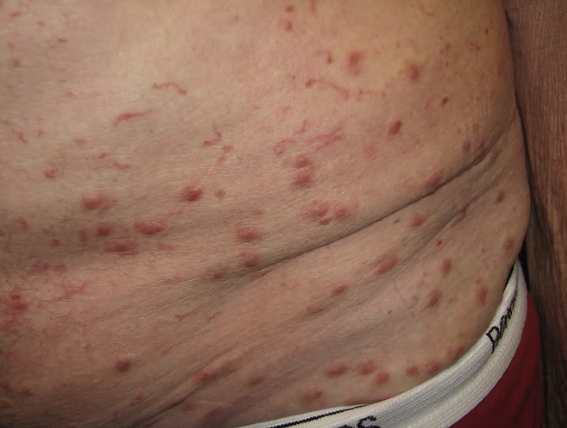
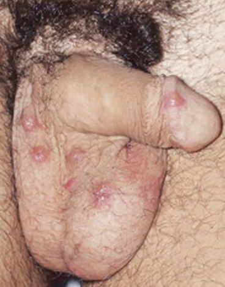

# Scabies
## Generelt
Også kendt som fnat.

## Differentialdiagnose

## Udredning
### Anamnese

### Objektiv us.
Q. Beskriv eksantemet – Diagnose(r)?

A. Multiple erytematøse papler - [[Scabies]]

Q. Beskriv eksantemet – Diagnose(r)?

A. Multiple erytematøse papler - [[Scabies]]

Q. Din patient viser symptomer på [[Scabies]]. Hvad vil du tilføje *den objektive us.*? 
A. Mikroskopi for mider i: 1) Mellem fingre, 2) Axiller og 3) Inguinalt

### Paraklinik

## Behandling
Alle familiemedlemmer behandles med permethincreme, alternativt systemisk Ivermectin. 

Tøjet skal vaskes og lægge i fryseren i et halvt døgn. Gentages efter en uge.

Q. Din patient (et barn) har [[Scabies]]. Hvornår må de komme i institution?
A. Når behandling er igangsat

## Opfølgning
Q. Din patient er i behandling for [[Scabies]] på 2. uge, men det klør stadig. Hvad nu?
A. Re-informer om frysning af tøj. Kløen er immunologisk og kan vare flere uger. Ingen grund til ændring.

Q. Hvor lang tid efter start af behandling for [[Scabies]] stopper kløen?
A. 6-10 uger

## Prognose

<!-- #anki/deck/Medicine #anki/tag/med/Derma -->
## Backlinks
* [[Scabies]]
	* Q. Beskriv eksantemet – Diagnose(r)?
A. Multiple erytematøse papler - [[Scabies]]
	* Q. Beskriv eksantemet – Diagnose(r)?
A. Multiple erytematøse papler - [[Scabies]]
	* Q. Din patient viser symptomer på [[Scabies]]. Hvad vil du tilføje *den objektive us.*? 
	* Q. Din patient (et barn) har [[Scabies]]. Hvornår må de komme i institution?
	* Q. Din patient er i behandling for [[Scabies]] på 2. uge, men det klør stadig. Hvad nu?
	* Q. Hvor lang tid efter start af behandling for [[Scabies]] stopper kløen?
* [[Atopisk dermatitis]]
	* [[Ichthyosis]]
[[Kontaktdermatitis]]
[[Nummulat dermatitis]]
[[Scabies]]
* [[Hånddermatitis]]
	* Q. Hvordan adskilles [[Hånddermatitis]] fra [[Scabies]]?
	* Q. Hvilke *infektiøse* differentialdiagnoser findes til [[Hånddermatitis]]?
* [[Udslet i håndflader]]
	* Q. Din patient kommer med dette udslet *og kløe*. Hvilke diagnoser tænker du?
A. 1) [[Scabies]], [[Medikamentelt eksantem]]

<!-- {BearID:BCF082EE-E8F3-4B33-975C-7855645F3C52-43570-0000502761E4A1EB} -->
