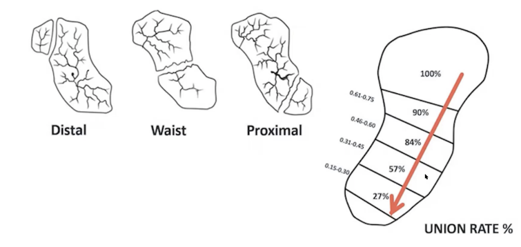
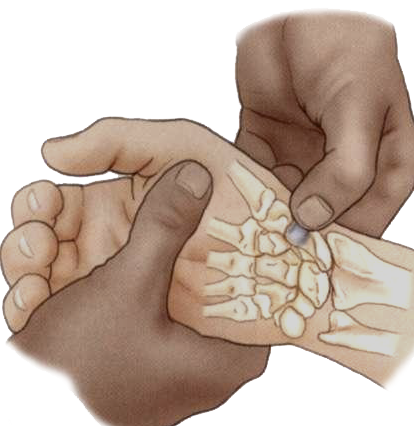
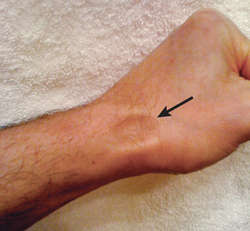
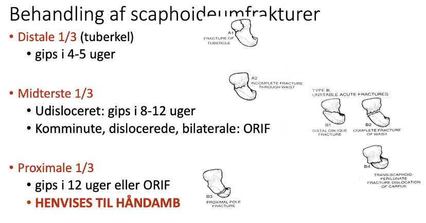
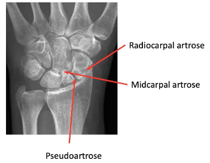

# Scaphoideumfraktur
## Generelt

Rygning rykker helingsraten fra 80% til 40%!

## Differentialdiagnose

## Udredning
### Anamnese

### Objektiv us.
Q. Hvad menes med *triadeømhed* ved OBS: [[Scaphoideumfraktur]]?
A. 1) Direkte ømhed i tabatieren 2) Indirekte ømhed langs tommelfingeren (OBS: Scaphoideumfraktur), 3) Ømhed ved tuberositas scaphoideum

Q. En patient har skade på radialsiden af hånden. Hvad skal du anføre i journalen?
A. 1) Direkte ømhed i tabatieren 2) Indirekte ømhed langs tommelfingeren 3) Ømhed ved tuberculum scaphoideum

Q. Hvor sidder tuberculum ossis scaphoidei?
A. 

Q. En patient er øm her. Hvad skal du være OBS på?

A. OBS: [[Scaphoideumfraktur]]

Q. Hvordan udredes en scaphoideumfraktur paraklinisk?
A. Rtg med scaphoideumoptagelser (45 grader proneret, 45 grader supineret)

### Paraklinik

## Behandling

## Opfølgning
Q. En rtg. OBS scaphoideumfraktur er negativ. Hvad nu?
A. MR, hvis ikke muligt, kontrol efter 12-14 dage (upåagtet klinik på tidspunktet)

Q. En patient fik taget rtg. OBS scaphoideumfraktur der var negativ. Pga. manglende adgang til MR, sendt til opfølgning nu 12-14 dage efter. Patienten har nu normal klinik. Hvad gør vi?
A. Stadig rtg., hyppigt uden klinik på trods af pågående fraktur, pågående fraktur giver komplikationer

## Prognose
Q. Hvilke komplikationer kan en ubehandlet scaphoideumfraktur give? 
A. Pseudoartrose: Smerter og instabilitet.

[[Pseudoartrose]]:

## Backlinks
* [[Scaphoideumfraktur]]
	* Q. Hvad menes med *triadeømhed* ved OBS: [[Scaphoideumfraktur]]?
	* Q. En patient er øm her. Hvad skal du være OBS på?
A. OBS: [[Scaphoideumfraktur]]
* [[Tommelfingersmerter]]
	* [[Pseudoartrose]]  efter [[Scaphoideumfraktur]]
* [[§Håndled]]
	* [[Scaphoideumfraktur]]
* [[Radiale håndledssmerter]]
	* [[Scaphoideumfraktur]]
[[Mb. de Quervain]]

<!-- #anki/tag/med/Orto #anki/deck/Medicine -->

<!-- {BearID:57CF324E-5C45-41D0-8382-7BA29E8E1385-98900-0000C1EFDA1DEA1A} -->
