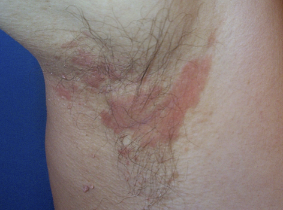

# Seboroisk dermatitis
## Generelt
Q. Hvad er ætiologien bag [[Seboroisk dermatitis]]?
A. Sebore og en gærsvamp

[[Infantil seboroisk dermatitis]]

## Differentialdiagnose
Q. Hvilke differentialdiagnoser overvejes ved [[Seboroisk dermatitis]]?
A. [[Kontaktdermatitis]], [[Psoriasis]] og [[SLE (systemisk lupus erythematosus)]].

## Udredning
### Anamnese

### Objektiv us.
Q. Hvor ses især [[Seboroisk dermatitis]]?
A. Hårbund, ansigt, bryst og hudfolder (hoftefleksurer)

Q. Hvordan ser [[Seboroisk dermatitis]] ud? 
A. *Skældannelse* og erytem

Q. Beskriv eksantemet – Diagnose(r)?

A. Skældannelse og erytem, [[Seboroisk dermatitis]]

### Paraklinik

## Behandling
Q. Hvilke faktorer forværrer [[Seboroisk dermatitis]]?
A. Vinter og psykisk stress

Q. Hvilke faktorer forbedrer [[Seboroisk dermatitis]]?
A. Sol

Q. Hvordan behandles [[Seboroisk dermatitis]] hos voksne?
A. 1) *Lokalt steroid (til dermatitis)*, 2) Antimykotisk beh. (eg. til hårbunden ketokonazol-shampoo), 3) Sollys 

Q. Hvordan skal man vaske sig ved [[Seboroisk dermatitis]]?
A. Med ketokonazol-shampoo, lad sidde i 5 minutter.

Q. Hvordan adskilles [[Seboroisk dermatitis]] fra [[Atopisk dermatitis]]?
A. [[Seboroisk dermatitis]] har 1) Skældannelse, 2) Er mere fedtet

## Opfølgning

## Prognose

## Backlinks
* [[Psoriasis]]
	* Q. Hvordan adskilles hårbundspsoriasis fra [[Seboroisk dermatitis]]?
* [[Atopisk dermatitis]]
	* [[Ichthyosis]]
[[Kontaktdermatitis]]
[[Nummulat dermatitis]]
[[Scabies]]
* [[Rosacea]]
	* Polymorft lysudslæt
[[Perioral dermatitis]]
[[Lupus erythematosus]]
[[Sarkoidose]]
* [[Seboroisk dermatitis]]
	* Q. Hvad er ætiologien bag [[Seboroisk dermatitis]]?
	* Q. Hvilke differentialdiagnoser overvejes ved [[Seboroisk dermatitis]]?
	* Q. Hvor ses især [[Seboroisk dermatitis]]?
	* Q. Hvordan ser [[Seboroisk dermatitis]] ud? 
	* Q. Beskriv eksantemet – Diagnose(r)?
A. Skældannelse og erytem, [[Seboroisk dermatitis]]
	* Q. Hvilke faktorer forværrer [[Seboroisk dermatitis]]?
	* Q. Hvilke faktorer forbedrer [[Seboroisk dermatitis]]?
	* Q. Hvordan behandles [[Seboroisk dermatitis]] hos voksne?
	* Q. Hvordan skal man vaske sig ved [[Seboroisk dermatitis]]?
	* Q. Hvordan adskilles [[Seboroisk dermatitis]] fra [[Atopisk dermatitis]]?
	* Q. Hvordan adskilles [[Seboroisk dermatitis]] fra [[Atopisk dermatitis]]?
* [[Dermatitis]]
	* [[Endogen dermatitis]]
	[[Seboroisk dermatitis]]
	[[Nummulat dermatitis]]
	[[Stasedermatitis]]
	[[Vesikuløs hånddermatitis]]
	[[Hyperkeratotisk hånddermatitis]]
* [[Skældannelse]]
	* [[Psoriasis]]
[[Kontaktdermatitis]]
[[Pityriasis rosea]]

<!-- #anki/tag/med/Derma #anki/deck/Medicine -->

<!-- {BearID:2354048E-88E3-4E57-A7A6-4A1DA8BC1A6C-959-00000782FA66EE46} -->
