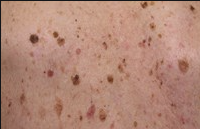

# Seboroisk keratose
## Generelt
Gammelmandsvorter

## Differentialdiagnose
[[Pigmenteret nævus]]
[[Pigmenteret basocellulært karcinom]]
[[Malignt melanom]]

## Udredning
### Anamnese

### Objektiv us.
Q. Hvilke objektive fund vil tyde på *[[Seboroisk keratose]]*? 
A. Flad, pigmenteret, vorteagtig og velafgrænset papel

Q. Hvad ses her?

A. [[Seboroisk keratose]]

### Paraklinik

## Behandling

## Opfølgning

## Prognose

## Backlinks
* [[Tumorer i huden]]
	* [[Keratinocyt]]
	[[Keratoakantom]]
	[[Milier]]
	[[Verruca vulgaris]]
	[[Kønsvorter (brug Condyloma acuminata)]]
	[[Molluscum contagiosum]]
* [[Seboroisk keratose]]
	* Q. Hvilke objektive fund vil tyde på *[[Seboroisk keratose]]*? 
	* Q. Hvad ses her?
A. [[Seboroisk keratose]]

<!-- #anki/tag/med/Derma #anki/deck/Medicine -->

<!-- {BearID:05ED8B9B-0706-4601-9C41-FEE3EFF5A919-51703-00006B9066EB1610} -->
