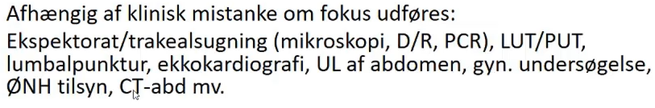

# Sepsis
## Generelt
2016: Livstruende organdysfunktion pga. dysreguleret host-respons på infektionen.

## Differentialdiagnose

## Udredning
### Anamnese

### Objektiv us.
Q. Hvordan defineres [[Sepsis]] diagnostisk?
A. Alle af flg: 1) Mistanke om infektion, 2) [[qSOFA]] over 1 *og* 3) [[SOFA]] over 1

Hvis [[qSOFA]] < 2 eller [[SOFA]] < 2, [[Simpel infektion]].

### Paraklinik

[[Gennemdyrkning]]

## Behandling
* AB
* Væske
* Specifik behandling af organdysfunktion

## Opfølgning

## Prognose

<!-- #anki/tag/med/gp #anki/deck/Medicine #anki/tag/med/Infectious  -->

## Backlinks
* [[Sepsis]]
	* Q. Hvordan defineres [[Sepsis]] diagnostisk?
* [[Addisonkrise (akut binyrebarkinsufficiens)]]
	* Q. En patient har hypotension, mavesmerter, kvalme/opkast og feber. Hvilke DDX overvejer du?
* [[Simpel infektion]]
	* Overvej altid om pt. har [[Sepsis]]. Hvis ikke, *dyrk* og behandl udfra formodet fokus.
* [[Septisk shock]]
	* Q. Hvordan defineres [[Septisk shock]]?
* [[Respirationsinsufficiens]]
	* Q. Hvordan vil du objektivt præhospitalt adskille en patient med [[Sepsis]] fra [[Hjerteinsufficiens]]?
	* Q. Hvordan vil du objektivt præhospitalt adskille en patient med [[Sepsis]] fra [[Hjerteinsufficiens]]?

<!-- {BearID:97DFD292-0D2A-4B8D-BF87-7CE2699204BB-3994-00000D04F2A4E978} -->
