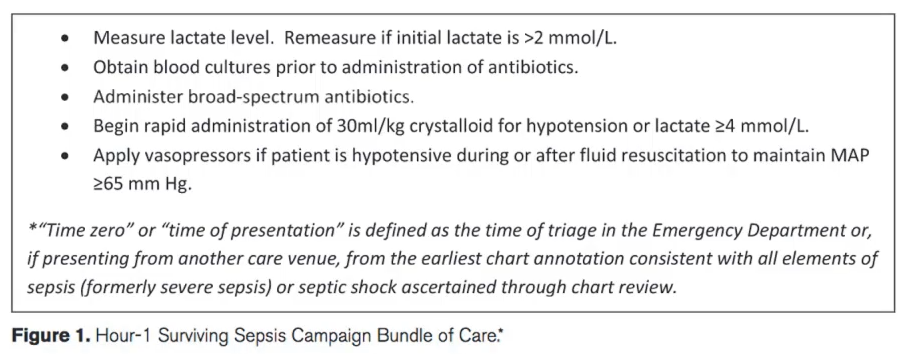

# Septisk shock
## Generelt

## Differentialdiagnose

## Udredning
### Anamnese

### Objektiv us.

### Paraklinik
Q. Hvordan defineres [[Septisk shock]]?
A. [[Sepsis]] + På trods af væskebehandling kan MAP kun nå over 65 *og* laktat under 2 med [[Vasopressor]].

## Behandling
1-hour bundle.

## Opfølgning

## Prognose

## Backlinks
* [[Septisk shock]]
	* Q. Hvordan defineres [[Septisk shock]]?

<!-- #anki/tag/med/Infectious #anki/deck/Medicine -->

<!-- {BearID:9849E3FB-E248-40DE-8575-271432FFD4DA-41270-000043E6797116BF} -->
