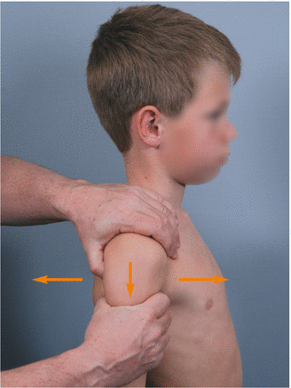

# Skuffetest i skulder
Q. Beskriv *skuffetesten* i *skulderleddet*.
A.

Q. Hvad tester skuffetesten for i skulderleddet?
A. Antero-posterior instabilitet

Q. Hvad er et abnormt resultat af skuffetesten i skulderleddet?
A. Smerte, krepitation

## Backlinks
* [[Undersøgelse af skulder]]
	* [[Skuffetest i skulder]]

<!-- #anki/tag/med/Orto #anki/deck/Medicine #anki/tag/med/GP -->

<!-- {BearID:4D377FB5-8AE3-4D1C-A2BF-36342EBC0911-53319-0000700E785E33EA} -->
