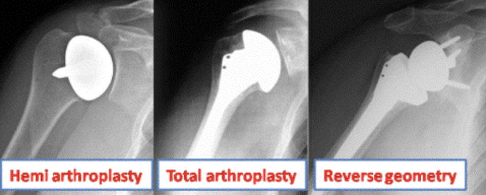
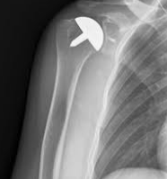
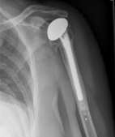

# Skulder-artroplastik
[[§Skulderen]]

Artroplastikker kan laves på 2 måder:
1. Anatomisk (hemi eller total), 
	1. Nærmest altid total der giver bedst bevægelighed
	2. Hemi giver bedst styrke
2. CTA
	1. En hemi-alloplastik med et stort caput
3. Revers 
	1. Fordel ved supraspinatus problemer, da man nemmere kan abducere med deltoideus.

Q. Hvilke typer artroplastik findes til skulder?
A. Anatomisk (hemi eller total) og revers

Q. Hvilke specifikke komplikationer findes til *skulder*-artroplastik?
A. Ruptur af m. subscapularis, skade på n. axillaris

## Anatomisk

Q. Hvornår bruges en anatomisk, total-artroplastik i skulderen?
A. Behov for 1) Total erstatning af skulderleddet, men kan 2) Klare sig uden store belastninger

Q. Hvornår bruges en anatomisk, hemi-artroplastik i skulderen?
A. Behov for både 1) Stor styrke og 2) Total erstatning af skulderleddet

## Revers
Q. Hvornår bruges en revers-artroplastik i skulderen?
A. Total supraspinatus-læsion

Q. Hvorfor bruges en revers-artroplastik i skulderen?
A. Det kan give abduktion via deltoideus

QD. Hvad er en revers-artroplastik i skulderen? – forkert, det er en CTA. Se ovenfor.
A. Stor caput humeri, så der opstår et “kunstigt” led uden cavitas glenoidale.

## Backlinks
* [[Glenohumoral artrose]]
	* [[Skulder-artroplastik]]
* [[Degenerative skulderlidelser]]
	* [[Skulder-artroplastik]]

<!-- #anki/tag/med/Orto #anki/deck/Medicine -->

<!-- {BearID:C07FB522-6716-4D1A-8C4B-BC6AF0A9AF55-9395-00001F3BD3F0B66B} -->
