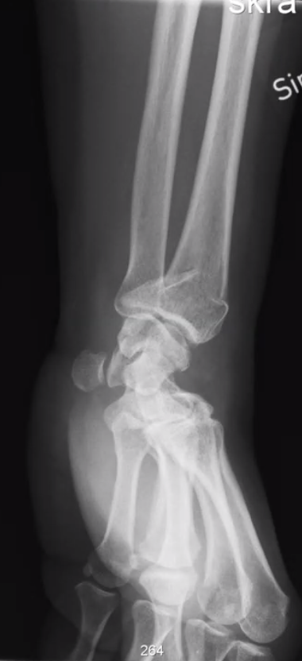
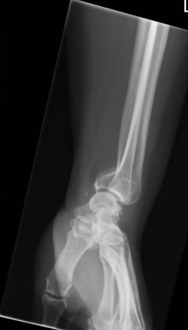

# Smiths fraktur
## Generelt

## Differentialdiagnose

## Udredning
### Anamnese

### Objektiv us.

### Paraklinik
Q. Hvad ses her?

A. [[Smiths fraktur]]

Q. Hvad ses her?

A. [[Smiths fraktur]]

## Behandling
Se [[Distal radius-fraktur]].

## Opfølgning

## Prognose
 

## Backlinks
* [[Distal radius-fraktur]]
	* Q. Hvilke [[Distal radius-fraktur]]-typer kender vi?
	* Q. Hvordan adskiller de forskellige typer [[Distal radius-fraktur]] sig fra hinanden?
* [[Smiths fraktur]]
	* Q. Hvad ses her?
A. [[Smiths fraktur]]
	* Q. Hvad ses her?
A. [[Smiths fraktur]]
* [[§Håndled]]
	* [[Distal radius-fraktur]]
	[[Smiths fraktur]]
	[[Bartons fraktur]]
	[[Chauffeurs fraktur]]

<!-- #anki/tag/med/Orto #anki/deck/Medicine -->

<!-- {BearID:76D606E8-BBB7-474F-B11C-ED01EBAF2E31-2960-00000B6589391FFD} -->
