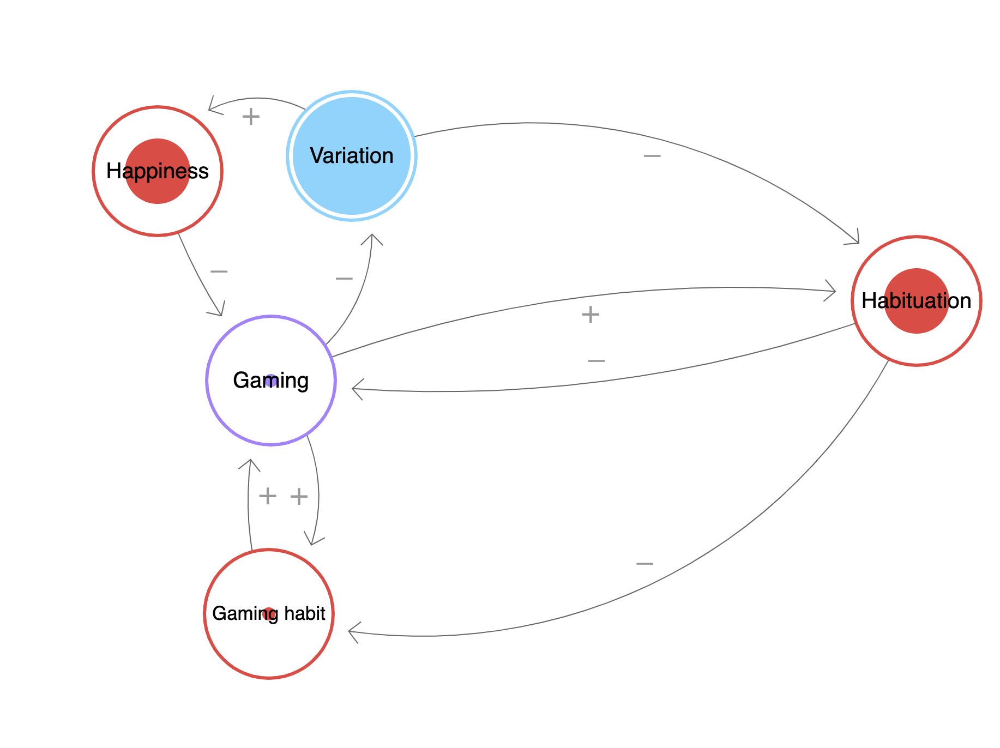

# Some games foster compulsion
By "compulsion" I mean habit-forming above and beyond what is beneficial to the user. It feels extrinsic to who you are, because your base brain has been trained, but your higher motivations aren't aligned with the behaviour. 

One model of why this [[Fast positive but delayed negative feedback fosters compulsion]]. I've drawn a diagram of that for gaming here: [Loopy](https://ncase.me/loopy/v1.1/?data=%5B%5B%5B1,625,398,1,%22Variation%22,4%5D,%5B2,551,604,0,%22Gaming%22,5%5D,%5B3,1143,531,0.5,%22Habituation%22,0%5D,%5B4,447,412,0.5,%22Happiness%22,0%5D,%5B5,390,610,0,%22Gaming%2520habit%22,0%5D,%5B6,458,744,0.16,%22Momentary%2520joy%22,0%5D%5D,%5B%5B2,1,-50,-1,0%5D,%5B1,3,85,-1,0%5D,%5B3,2,38,-1,0%5D,%5B2,3,41,1,0%5D,%5B1,4,-60,1,0%5D,%5B2,6,49,1,0%5D,%5B6,5,24,1,0%5D,%5B5,2,20,1,0%5D,%5B3,6,113,-1,0%5D,%5B4,2,-13,-1,0%5D%5D,%5B%5D,6%5D).

This leads to [[Negative effects of compulsion]].

How do we adjust this system to better fit my needs? We can:
* Decrease the “(-)Happiness (+)> Gaming” via ACT and mindfulness
* Decrease the “Gaming habit (+)> Gaming” via:
	* Increase number of stopping cues 
		* Decrease size of units ([[Unit bias]])
		* Increase time awareness ([[Compulsion is potent when you lose track of time]])
	* [[Select games to avoid problematic use]]
	* Beeminder

* [[Select games to avoid problematic use]]
* [[Can I build a healthy relationship with gaming?]]

## Backlinks
* [[§Gaming]]
	* But, there are cases and circumstances where gaming can tremendously worsen my life. [[Some games foster compulsion]], in the sense that they are habit-forming above and beyond what is beneficial to the user ([[§Gaming downsides]]).
* [[Can I build a healthy relationship with gaming?]]
	* [[Select games to avoid problematic use]], and it means *putting in place systems and behaviours that compete with the addiction loop* ([[Some games foster compulsion]]).
* [[§Compulsion]]
	* [[Compulsion is potent when you lose track of time]], [[Some games foster compulsion]], [[Negative effects of compulsion]].
* [[§Gaming downsides]]
	* Because [[Gaming is always available]], and [[Some games foster compulsion]], it can cause problems that other hobbies can’t. For example:
* [[Gaming and depression can become a positive feedback loop]]
	* This is part of the reason that [[Some games foster compulsion]].

<!-- #p1 -->

<!-- {BearID:8B460FBF-D90F-4B3E-9BDD-FEB196C0EB3A-34673-00003280A250D318} -->
