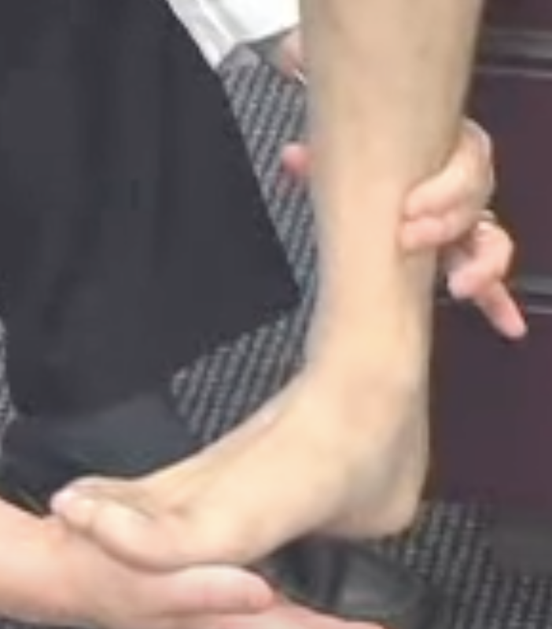

# Squeeze-test
Q. Beskriv en *[[Squeeze-test]]*.
A. Dorsiflekter fod, klem om tibia og fibula.

Q. Hvad tester en *[[Squeeze-test]]* for?
A. *[[Syndesmoseruptur]]*

Q. Hvilken test kan bruges til at teste for *[[Syndesmoseruptur]]*?
A. *[[Squeeze-test]]*

Q. Hvad er et abnormt resultat af en *[[Squeeze-test]]*?
A. Smerter og/eller fleksibilitet

 

## Backlinks
* [[Squeeze-test]]
	* Q. Beskriv en *[[Squeeze-test]]*.

	* Q. Hvad tester en *[[Squeeze-test]]* for?
	* Q. Hvilken test kan bruges til at teste for *[[Syndesmoseruptur]]*?
	* Q. Hvad er et abnormt resultat af en *[[Squeeze-test]]*?
* [[Us. af fod og ankel]]
	* *Palpation:*

<!-- #anki/tag/med/Orto #anki/deck/Medicine -->

<!-- {BearID:9BBA401F-E50E-48A3-BD86-CEC639BC4F0E-22870-00006C80D7C44864} -->
