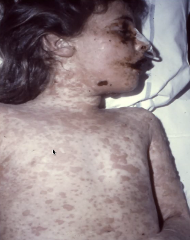

# Steven-Johnsons Syndrom (SJS)
## Generelt

## Differentialdiagnose

## Udredning
### Anamnese

### Objektiv us.

### Paraklinik

## Behandling

## Opfølgning

## Prognose

## Backlinks
* [[Toksisk epidermal nekrolyse]]
	* Hvis mere end > 30% af huden afficeret. Google grænserne, ellers [[Steven-Johnsons Syndrom (SJS)]]
* [[Medikamentelt eksantem]]
	* [[Steven-Johnsons Syndrom (SJS)]]

<!-- #anki/tag/med/Derma #anki/deck/Medicine -->

<!-- {BearID:532D01C0-4D6D-4A3A-BAE3-DE393DC55A0E-31930-000063C95A8F023A} -->
