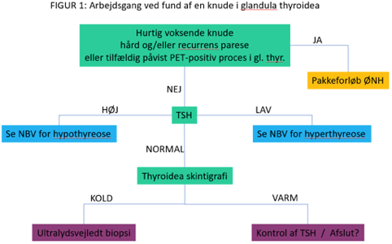
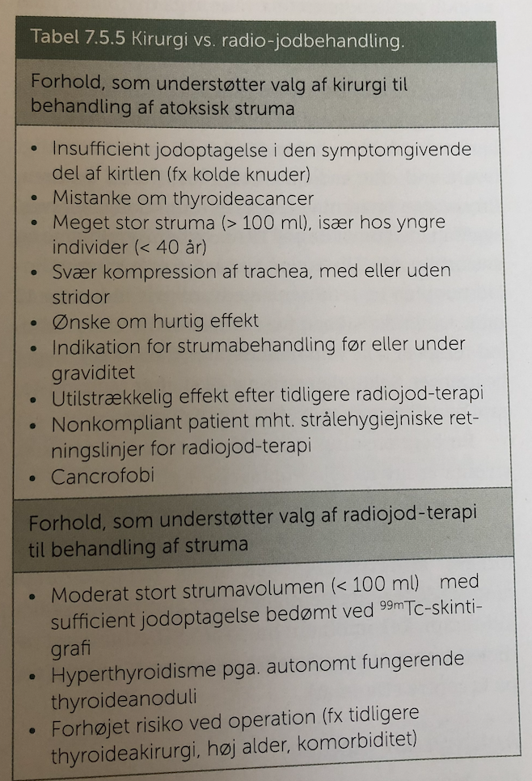

# Struma
## Generelt
* [[Diffus struma]]
	* [[Graves sygdom]]
	* [[Kronisk autoimmun thyroiditis]]
* [[Solitær nodøs struma]]
* [[Multinodøs struma]]
	* [[Toxisk multinodøs struma]]

Q. Hvilke typer struma erkendes klinisk?
A. 1) [[Diffus struma]], 2) [[Solitær nodøs struma]], 3) [[Multinodøs struma]]

## Differentialdiagnose
Q. Hvilke *autoimmune* årsager kan medføre [[Struma]]?
A. 1) [[Mb. Graves]], 2) [[Kronisk autoimmun thyroiditis]], 3) [[Riedels thyroiditis]]

Q. Hvilke *neoplastiske* årsager kan lede til [[Struma]]?
A. Benign eller malign tumor

Q. Hvilke *endokrine* årsager kan lede til [[Struma]]?
A. Fysiologisk hos teenagere eller gravide

Q. Under hvilke omstændigheder mistænkes [[Struma]] som malign?
A. 1) Nodulus der er enten: Hård, fast adhærent eller hurtigt voksende, 2) [[n. laryngeus recurrens]]-parese, 3) hævede lymfeknuder

[Knuden i thyroidea - Dansk Endokrinologisk Selskab](https://endocrinology.dk/nbv/thyroideasygdomme/udredning-af-knuden-i-glandula-thyreoidea/)

Q. Hvordan vurderer vi paraklinisk om en knude i thyroidea bør biopteres?
A. 1) UL med TIRADS-kriterier, 2) Skintigrafi (hvis varm, ingen biopsi)

## Udredning
### Anamnese
Q. Din patient med [[Struma]] har smerter i thyroidea. Hvad tænker du? 
A. OBS 1) Blødning i nodulus, 2) Malignitet

### Objektiv us.
Q. Hvordan palperes [[Struma]] bedst?
A. Let ekstension af nakke + synkebevægelse.

Q. Din patient viser symptomer på [[Struma]]. Hvad vil du tilføje *den objektive us.*? 
A. 1) Palpation for konsistens, 2) *Altid* palpation af lymfeknuder på hals.

### Paraklinik

## Behandling

[[Radiojod]]

## Opfølgning

## Prognose

## Backlinks
* [[Radiojod]]
	* Typisk et fald i volumen af [[Struma]] på 40% over et år.
* [[Struma]]
	* Q. Hvilke *autoimmune* årsager kan medføre [[Struma]]?
	* Q. Hvilke *neoplastiske* årsager kan lede til [[Struma]]?
	* Q. Hvilke *endokrine* årsager kan lede til [[Struma]]?
	* Q. Under hvilke omstændigheder mistænkes [[Struma]] som malign?
	* Q. Din patient med [[Struma]] har smerter i thyroidea. Hvad tænker du? 
	* Q. Hvordan palperes [[Struma]] bedst?
	* Q. Din patient viser symptomer på [[Struma]]. Hvad vil du tilføje *den objektive us.*? 
* [[Lokal knude på halsen]]
	* [[Struma]]

<!-- #anki/tag/med/Derma #anki/deck/Medicine #anki/tag/med/GP #anki/tag/med/Otolarynghology -->

<!-- {BearID:B3C35DB5-A8DB-466E-9DD4-2B5504290DBA-19264-00002247E4D2ACF4} -->
