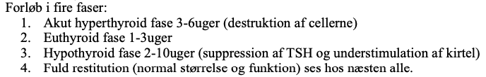

# Subakut thyroiditis
## Generelt

## Differentialdiagnose

## Udredning
### Anamnese

### Objektiv us.

### Paraklinik

## Behandling
Q. Hvad er behandling af subakut thyroiditis i den hyperthyreotiske fase?
A. Evt. [[Beta-blokker]]. Anti-thyroide stoffer ingen effekt, da det er allerede syntetiserert [[T4]] der frigives.

Q. Hvad er behandling af subakut thyroiditis i den hypothyreotiske fase?
A. Hvis symptomer, [[LT4 (Levothyroxin)]].

## Opfølgning

## Prognose

## Backlinks
* [[Hypothyreose (myxødem)]]
	* [[Subakut thyroiditis]]
* [[Thyrotoxikose]]
	* Sjældnere:
	[[Infektiøs thyroiditis (akut thyroiditis)]] (2%)
	Iatrogent/medikamentelt
* [[Thyroiditis]]
	* Resten:
[[Riedels thyroiditis]]
[[Postpartum thyroiditis]]
[[Stråleudløst thyroiditis]]

<!-- #anki/tag/med/Endocrinology #anki/deck/Medicine -->

<!-- {BearID:4FA23B02-870E-4B63-9ACC-62AC753C6C96-31003-0000692A90052812} -->
