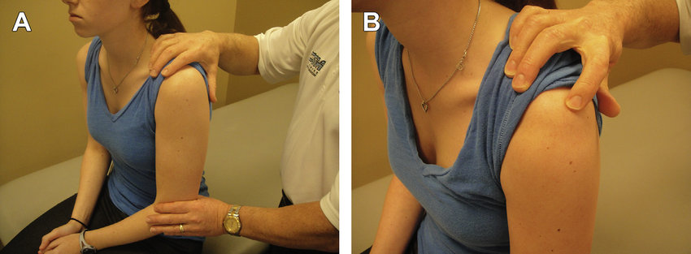
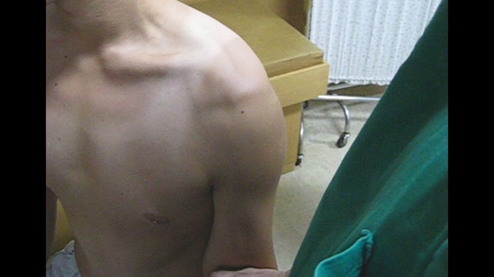

# Sulcustesten
Q. Beskriv *sulcustesten* i *skulderleddet*.
A. 

Q. Hvad tester *sulcustesten* for i *skulderleddet*?
A. Inferior instabilitet

Q. Hvad er et abnormt resultat af *sulcustesten* i *skulderleddet*?
A. Tydelig sulcus subacromialt

## Backlinks
* [[Undersøgelse af skulder]]
	* [[Sulcustesten]]
* [[Us. af skulder]]
	* Normal [[Sulcustesten]]. 

<!-- #anki/tag/med/Orto #anki/deck/Medicine #anki/tag/med/GP -->

<!-- {BearID:25BE9842-FEA2-4F36-B5CE-1B308496A378-53319-00007010730832D9} -->
