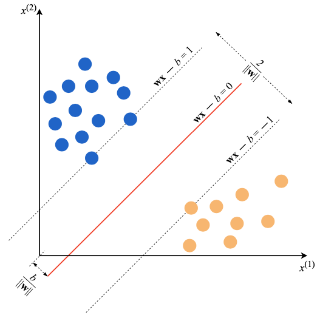
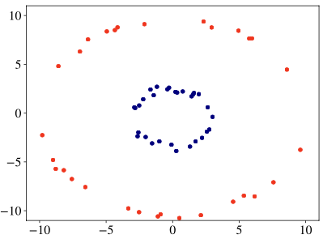
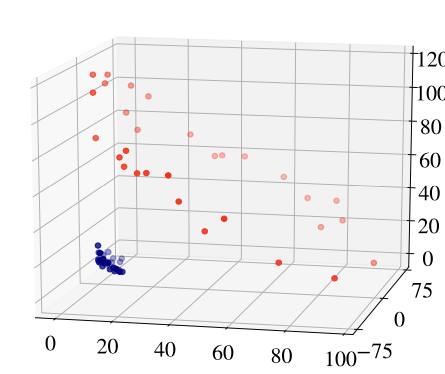

# Support Vector Machine
Q. Which parameter(s) does a support vector machine maximise?
A. The margin between categories 

Q. 

Which type of machine learning model does this illustration represent?
A. A support vector machine

Q. How might we allow SVM to be used on data that is not separable by a hyperplane?
A. Transform the original space into higher dimensions

Q. What is a kernel for SVM?
A. A mapping function to higher dimensions allowing SVM to satisfy 1) Dealing with non-linearity and 2) Remaining computationally efficient.

Q. What might the point be of transforming:

to:

A. Allow separability by a plane for SVM.

<!-- #anki/deck/ML# -->

## Backlinks
* [[§Machine Learning]]
	* [[Support Vector Machine]]

<!-- {BearID:BFC6C590-2E97-4383-9DA3-ED721D58B07D-4241-00000A80B62EA8E1} -->
