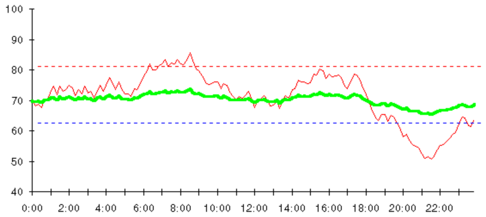

# Systems should guide towards the desired state
This is because [[Balance is everything]].

This means that systems should provide the right feedback ([[§Feedback]]), and probably give negative feedback at both the upper and lower bound.

Ideally with proportional control, since [[Proportional control stabilizes systems]]. However, beware that you stabilise the right thing! Sometimes systems need to be flexible so attain stability in other areas, eg. work hours are flexible to attain psychological stability. 

This is somewhat counter to [[Act through discomfort]]; just because you feel uncomfortable doesn't mean that the right thing is to work less. It all depends on severity. 

[[Positive feedback]] is dangerous, it leads to explosions. We want negative feedback when exceeding desired states in either direction.

Examples of this might be:
* [[My: Use systems to guide time]]

---

Q. Why might we want to design systems  to provide feedback at both an upper and lower bound?
A. [[Balance is everything]]! We rarely want to maximise or minimise.

## Backlinks
* [[§Systems Thinking]]
	* [[Systems should guide towards the desired state]]
* [[My: Use systems to guide time]]
	* [[Systems should guide towards the desired state]], andthis is probably useful for dedicating time to work! You want to work a sufficient amount of time, but reserve time for leisure and exploration.

<!-- {BearID:320083F7-E9D5-495F-BB43-7A755667015C-662-00000051AB082AB4} -->
