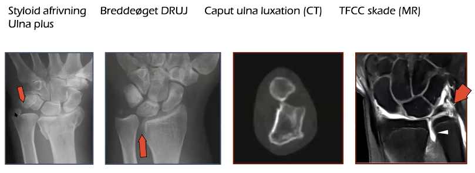

# TFCC-skade
## Generelt
Skade i brusken mellem håndrodsknogler, ulna og radius.

Kan ses som:

## Differentialdiagnose

## Udredning
### Anamnese

### Objektiv us.
1) Piano-key sign, 2) Balottement-test

### Paraklinik

## Behandling

## Opfølgning

## Prognose
 

## Backlinks
* [[§Håndled]]
	* [[TFCC-skade]]

<!-- #anki/tag/med/Orto #anki/deck/Medicine -->

<!-- {BearID:10C1BD04-96AF-4FDB-A547-2F88FB2BFD52-15618-0000214C6A307DD4} -->
