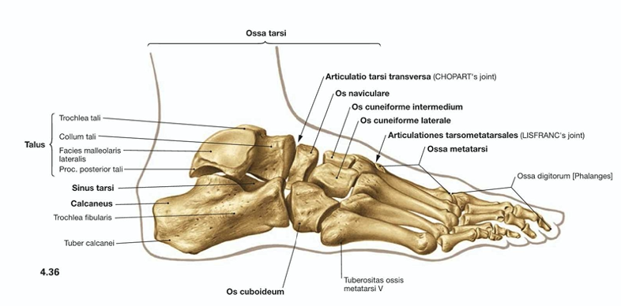
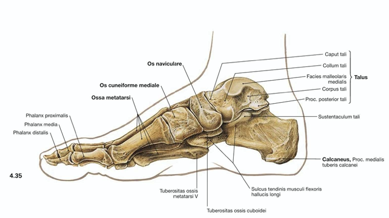
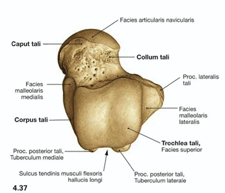
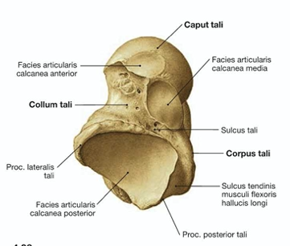

# Talus

Q. Beskriv [[Talus]] blodforsyning
A. Ingen muskeltilhæftning, så kun ledkapsel

## Backlinks
* [[Talus]]
	* Q. Beskriv [[Talus]] blodforsyning
* [[Talusfraktur]]
	* Q. Hvilke knogler har [[Talus]] ledflader til?

<!-- #anki/tag/med/Orto #anki/deck/Medicine -->

<!-- {BearID:C340F65B-DD9B-422F-BCB6-7C62BCB52D0D-65488-0000772C7EBF2B4D} -->
