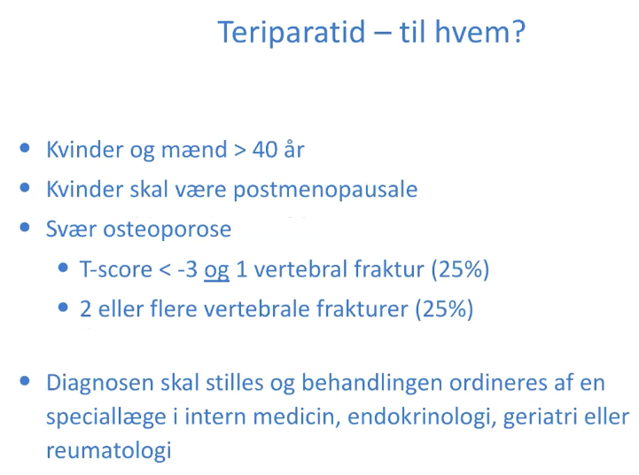

# Teriparatid

Q. Hvordan fungerer [[Teriparatid]]?
A. Syntetisk [[PTH]]. Gives i daglig bolus (i modsætning til konstant [[PTH]], der vil medføre knogledemineralisering).

Q. Hvorfor giver [[Teriparatid]] ikke knogleresorption?
A. Gives i daglig bolus (i modsætning til konstant [[PTH]], der vil medføre knogledemineralisering).

Q. Hvordan administreres [[Teriparatid]]?
A. Dagligt s.c.

## Backlinks
* [[Osteoporose]]
	* [[Teriparatid]], større effekt end [[Bisfosfonat]]
	* Q. Nævn et eksempel på knogleanabol behandling af [[Osteoporose]].
* [[Teriparatid]]
	* Q. Hvordan fungerer [[Teriparatid]]?
	* Q. Hvorfor giver [[Teriparatid]] ikke knogleresorption?
	* Q. Hvordan administreres [[Teriparatid]]?

<!-- #anki/deck/Medicine #anki/tag/med/Pharmacology #anki/tag/med/Endocrinology -->

<!-- {BearID:20D4E108-1F74-4F67-95A4-7CA7B42AB635-83502-00005D1689ED058A} -->
