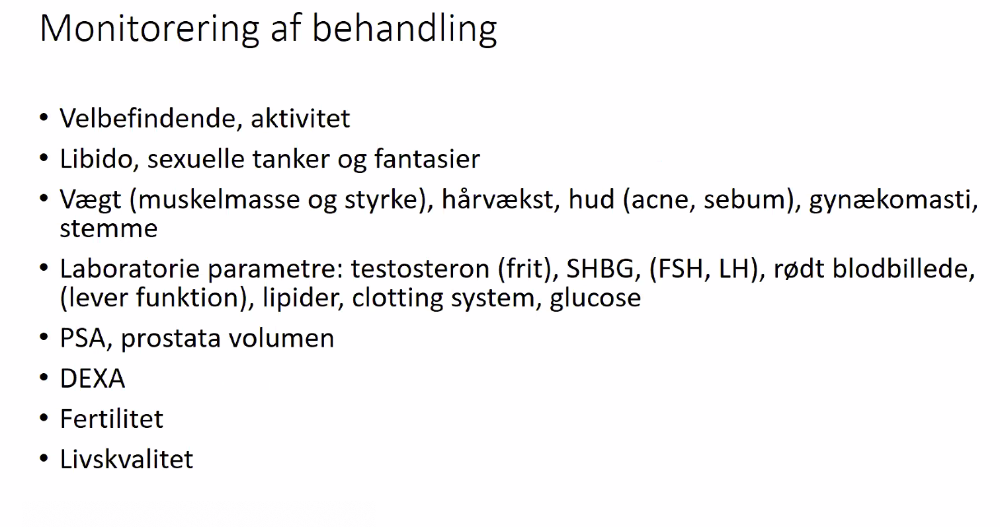

# Testosteron
Q. En patient skal starte i testosteronbehandling. Hvad bør gøres?
A. 1) Vurdering af kontraindikationer (s-HgB, rektaleksploration, [[PSA]]), 2) Information om risiko for [[Infertilitet]], 3) Deponering af sæd

Q. En patient vil i behandling med [[Testosteron]] på god indikation. Hvilke kontraindikationer kan stoppe beh.? 
A. 1) Forhøjet hæmatokrit, 2) [[Cancer mammae]], 3) [[Cancer prostata]], 4) Udtalt [[Rosacea]]

## Backlinks
* [[Testosteron]]
	* Q. En patient vil i behandling med [[Testosteron]] på god indikation. Hvilke kontraindikationer kan stoppe beh.? 
* [[LH]]
	* Q. Hvilke biokemiske faktorer *hæmmer* sekretion af [[LH]]? 
* [[Oligomenorre]]
	* Q. Din patient viser symptomer på [[Oligomenorre]]. Hvad vil du tilføje til *paraklinikken*? 
* [[FSH]]
	* Q. Hvilke biokemiske faktorer *hæmmer* sekretion af [[FSH]]? 
* [[Infertilitet]]
	* Q. Din patient har [[Infertilitet]] i AP. Hvad vil du tilføje til *paraklinikken* for /kvinden/? 
* [[Sekundær hypogonadisme]]
	* Kan være normal i kombination med lav [[Østrogen]]/[[Testosteron]]. Det vil altså være “inappropriat lav”.
* [[§Testes]]
	* Q. Hvordan kan man teste [[§Testes]]’ mulighed for at producere [[Testosteron]]?
* [[Hypogonadisme]]
	* Q. Hvordan stilles diagnosen [[Hypogonadisme]] hos mænd?
* [[PCOS]]
	* Q. Hvorfor har kvinder med [[PCOS]] [[Hyperandrogenisme]]?
* [[Primær hypogonadisme]]
	* Q. Hvordan er binyren involveret i [[Primær hypogonadisme]]?
* [[Androgener]]
	* Eg. [[Testosteron]].

<!-- #anki/tag/med/Endocrinology #anki/deck/Medicine -->

<!-- {BearID:1F8D62D5-7F2F-4D25-8939-B634CB7F903D-966-000016BBF60F0A2F} -->
