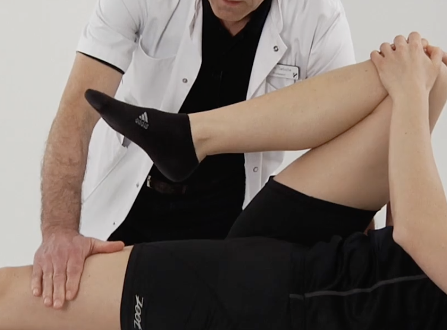
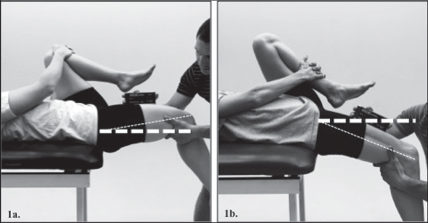

# Thomas' test

Husk at fiksere lænd.

Q. Beskriv *[[Thomas' test]]* i hoften.
A. Fleksion af rask hofte på lejet for at teste for kompensatorisk hyperlordose

Q. Hvad tester *[[Thomas' test]]* for i hoften?
A. Fleksionskontraktur

Q. Hvad er et abnormt resultat af *[[Thomas’ test]]* i hoften?
A. Fleksion af rask hofte medfører ophævelse af hyperlordose, der medfører at modsatte ben løfter sig fra lejet

## Backlinks
* [[Thomas' test]]
	* Q. Beskriv *[[Thomas' test]]* i hoften.

	* Q. Hvad tester *[[Thomas' test]]* for i hoften?
* [[Undersøgelse af hofte]]
	* [[Thomas' test]]
	* Q. Hvilke funktionelle tests kender du til [[Undersøgelse af hofte]]?

<!-- {BearID:00EB4ED2-19F0-4EDA-9DBA-7D1D08A500A1-17080-000033E64C42A201} -->
