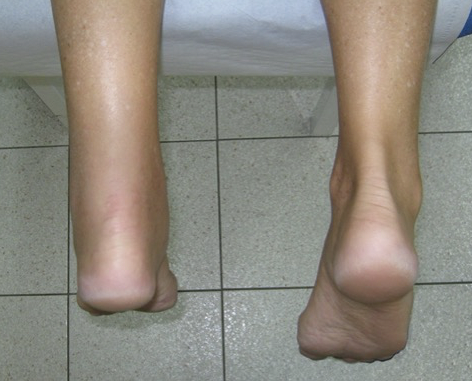

# Thompsons test
Q. Beskriv *[[Thompsons test]]* i ankel.
A. Pt. på maven med ankel udover kant. Lægmusklen klemmes. Hvis akillessene bristet, ingen plantarfleksion.

Q. Hvad tester *Thompsons* test for i ankel?
A. [[Achillesseneruptur]]

Q. Hvad er et abnormt resultat af *Thompsons* test i ankel?
A. Manglende plantarfleksion ved klem om lægmuskel

## Backlinks
* [[Achillesseneruptur]]
	* Q. Hvad indeholder din kliniske undersøgelse for akillesseneruptur?
* [[Thompsons test]]
	* Q. Beskriv *[[Thompsons test]]* i ankel.

* [[Calcaneusfraktur]]
	* Q. Din patient viser symptomer på [[Calcaneusfraktur]]. Hvad vil du tilføje *den objektive us.*? 

<!-- #anki/tag/med/Orto #anki/deck/Medicine -->

<!-- {BearID:D877E859-569E-4F97-A323-6120EEB1F5EC-21842-00003D81B92ED9BE} -->
