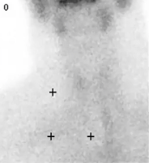
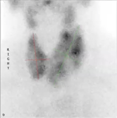
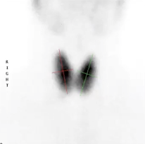

# Thyroideaskintigrafi
## Generelt
Q. Hvad ses her?

A. Manglende iodoptag ved en [[Thyroideaskintigrafi]], OBS forøget iodindtag (kontrast, amiodaron, lithium etc.) eller [[Thyroiditis]]. Desuden se nedenfor.

Q. Hvad ses her?

A. Stor, multinodøs optagelse, OBS [[Toxisk multinodøs struma]]

Q. Hvad ses her?

A. Stærk optagelse overalt i kirtlen, OBS [[Graves sygdom]].

## Backlinks
* [[Thyrotoxikose]]
	* Q. Din patient har [[Thyrotoxikose]], men negative [[TRAb]]. Hvad nu?
* [[Subklinisk hyperthyreose]]
	* Q. Din patient viser symptomer på [[Subklinisk hyperthyreose]]. Hvad vil du tilføje til *paraklinikken*? 
* [[Thyroideaskintigrafi]]
	* Q. Hvad ses her?
A. Manglende iodoptag ved en [[Thyroideaskintigrafi]], OBS forøget iodindtag (kontrast, amiodaron, lithium etc.) eller [[Thyroiditis]]. Desuden se nedenfor.

<!-- #anki/tag/med/Endocrinology #anki/deck/Medicine -->

<!-- {BearID:5D16FAD9-EFDB-412C-8D59-553F115A654F-31003-000069751D2E6A21} -->
