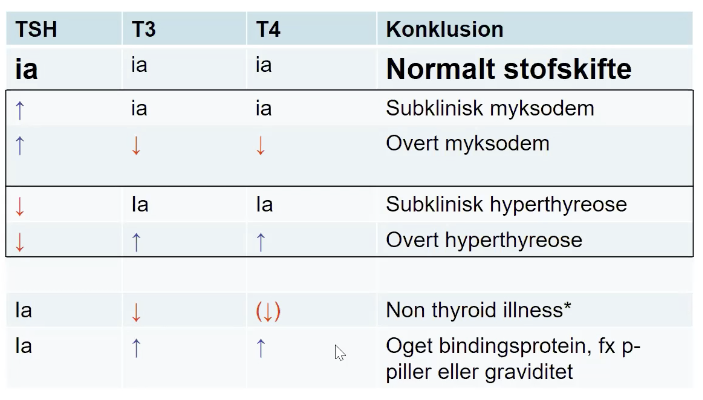
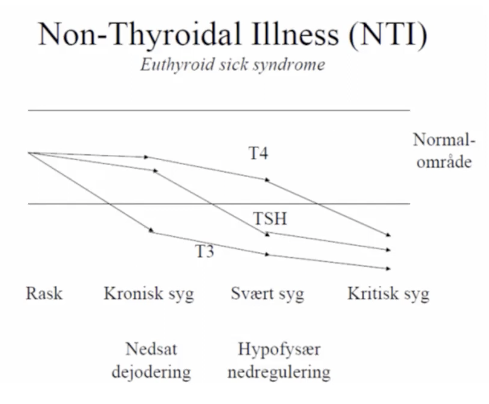

# Thyroideasygdom (fortolkning af blodprøver)

[[Hypothyreose (myxødem)]]
[[Hyperthyreose (for udredning, se Thyrotoxikose)]]
	[[Subklinisk hyperthyreose]]

## Backlinks
* [[Thyroidea]]
	* [[Thyroideasygdom (fortolkning af blodprøver)]]

<!-- {BearID:5FB251F1-4D74-403C-9A02-EB55DD7581A2-27973-000041BE30F82C62} -->
