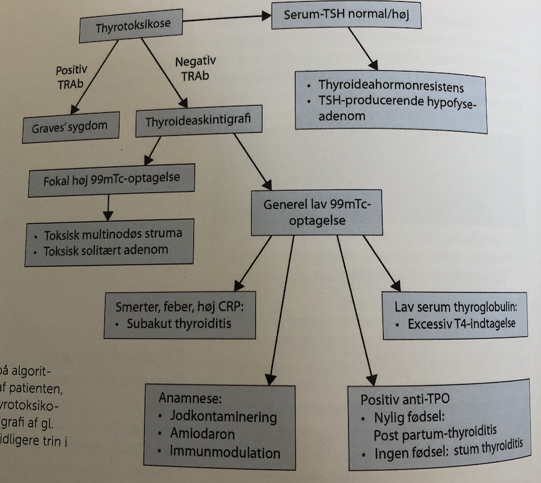
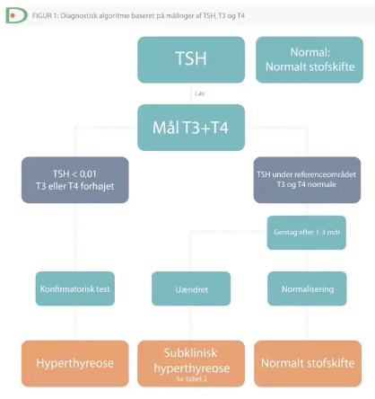

# Thyrotoxikose
## Generelt
Hvis det skyldes produktion i gl. thyroidea kaldes det [[Hyperthyreose (for udredning, se Thyrotoxikose)]].

## Differentialdiagnose
Q. Hvad er de primære årsager til [[Thyrotoxikose]]?
A.  1) [[Toxisk multinodøs struma]] (50%), 2) [[Graves sygdom]] (40%), 3) [[Toxisk solitært adenom]] (5%)

Sjældnere:
	[[Subakut thyroiditis]]
	[[Infektiøs thyroiditis (akut thyroiditis)]] (2%)
	Iatrogent/medikamentelt
* Desuden flere sjældne.

Q. I hvilken alder ses især [[Toxisk multinodøs struma]]?
A. 60+

## Udredning

Hvis hyperthyreose:

### Anamnese
Q. Hvilke ting i anamnesen vil tyde på *[[Thyrotoxikose]]*? 
A. 1) Indre uro, 2) Hjertebanken, 3) Svedtendens, 4) Vægttab på trods af stor appetit, 5) Hviletremor

### Objektiv us.
Q. Din patient viser symptomer på [[Thyrotoxikose]]. Hvad vil du tilføje til *den objektive us.*? 
A. 1) Øjne (OBS orbitopati), 2) *Altid* palpation for struma/noduli., 3) [[St. p.]], 4) Ødemer, 5) Vægt

OBS:
1. Orbitopati
2. Incompensatio
3. AFLI
4. Vægttab

### Paraklinik
Q. Din patient viser symptomer på [[Thyrotoxikose]]. Hvad vil du tilføje til *paraklinikken*? 
A. 1) [[BT]], 2) [[TSH]], 3) [[T3]] og [[T4]], [[EKG]]. Hvis TSH < 0,01: 4) [[TRAb]]

Q. Hvornår tages [[TRAb]] ved [[Thyrotoxikose]]?
A. Når TSH < 0,01 og T3+T4 er forhøjede.

Q. Din patient har [[Thyrotoxikose]], men negative [[TRAb]]. Hvad nu?
A. [[Thyroideaskintigrafi]], OBS [[Toxisk multinodøs struma]].

## Behandling
Q. Hvilken sektor behandler [[Thyrotoxikose]]?
A. Sekundærsektoren

Q. Hvornår behandles [[Thyrotoxikose]]?
A. Hvis enten 1) Kliniske symptomer, 2) Subklinisk og TSH gentagent < 0,01 eller 3) TSH < 0,03 og risikofaktorer

Q. Hvordan behandles [[Thyrotoxikose]]?
A. Enten A) Medicinsk, 1) [[Methimazol]] og 2) [[Beta-blokker]], B) [[Radiojod]] eller C) Kirurgi.

Q. Hvad menes med block-replacement therapy?
A. Total blokering af [[T3]]/[[T4]], dernæst [[LT4 (Levothyroxin)]]

Q. Hvornår overvejes block-replacement therapy?
A. Hvis 1) Øjensymptomer, 2) Svært regulerbar

Q. Din patient med [[Thyrotoxikose]] har øjensymptomer. Hvilke overvejelser giver det for behandlingen?
A. Overvej [[Block-replacement therapy]].

Q. Din patient har [[Thyrotoxikose]]. Hvor hyppigt monitoreres [[TSH]] + [[T3]] + [[T4]] ift. behandlingstilpasning?
A. Hver 2. uge (T4s halveringstid ca. 1 uge)

## Opfølgning

## Prognose

[[Thyrotoxikose (brug hyperthyreose]]

<!-- #anki/tag/med/Endocrinology #anki/deck/Medicine -->

## Backlinks
* [[Thyrotoxikose]]
	* Q. Hvad er de primære årsager til [[Thyrotoxikose]]?
	* Q. Hvilke ting i anamnesen vil tyde på *[[Thyrotoxikose]]*? 
	* Q. Din patient viser symptomer på [[Thyrotoxikose]]. Hvad vil du tilføje til *den objektive us.*? 
	* Q. Din patient viser symptomer på [[Thyrotoxikose]]. Hvad vil du tilføje til *paraklinikken*? 
	* Q. Hvornår tages [[TRAb]] ved [[Thyrotoxikose]]?

	* Q. Din patient har [[Thyrotoxikose]], men negative [[TRAb]]. Hvad nu?
	* Q. Hvilken sektor behandler [[Thyrotoxikose]]?
	* Q. Hvornår behandles [[Thyrotoxikose]]?
	* Q. Hvordan behandles [[Thyrotoxikose]]?
	* Q. Din patient med [[Thyrotoxikose]] har øjensymptomer. Hvilke overvejelser giver det for behandlingen?
	* Q. Din patient har [[Thyrotoxikose]]. Hvor hyppigt monitoreres [[TSH]] + [[T3]] + [[T4]] ift. behandlingstilpasning?
* [[Hyperthyreose (for udredning, se Thyrotoxikose)]]
	* [[Thyrotoxikose]] der skyldes produktion i gl. thyroidea.
	* Q. Hvordan adskiller [[Hyperthyreose]] sig fra [[Thyrotoxikose]]?
	* Q. Hvordan adskiller [[Hyperthyreose]] sig fra [[Thyrotoxikose]]?
	* Q. Hvordan adskiller [[Hyperthyreose]] sig fra [[Thyrotoxikose]]?
* [[Graves sygdom]]
	* Q. Din patient med [[Graves sygdom]] veksler nu mellem [[Thyrotoxikose]] og [[Hypothyreose (myxødem)]]. Hvad tænker du?
	* Kan behandles med den klassiske for [[Thyrotoxikose]] + LT4.
* [[Oligomenorre]]
	* Q. Hvilke *endokrine* årsager findes til [[Oligomenorre]]?
* [[Sekundær hyperthyreose]]
	* En type [[Thyrotoxikose]].
* [[Kvalme i graviditet]]
	* Q. Hvilke differentialdiagnoser bør overvejes ved [[Kvalme i graviditet]]?
* [[Graves orbitopati (TAO)]]
	* Q. Hvordan behandles [[Graves orbitopati (TAO)]]?
* [[Metroragi]]
	* Q. Hvilke endokrine årsager findes til metroragi i en ung kvinde?
	* Q. Hvilke endokrine årsager findes til metroragi i en kvinde på 45?
* [[RLS]]
	* Q. Hvilke *endokrine* differentialdiagnoser findes til [[RLS]]?

<!-- {BearID:C246E063-BC60-4239-BBBC-C12F2CD1B1F1-83502-000063B6963008B1} -->
