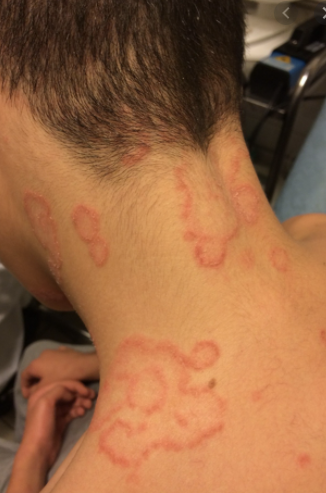
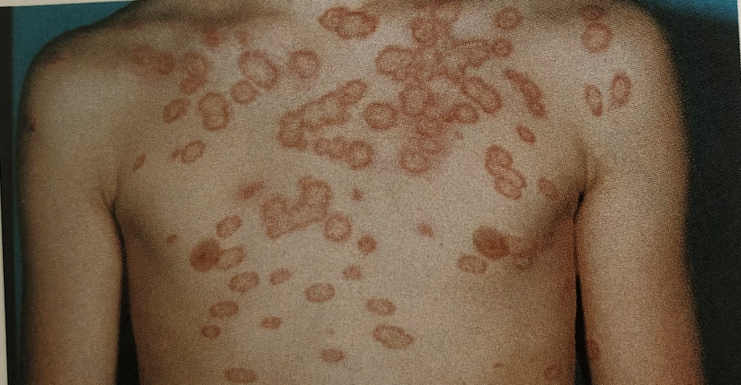

# Tinea corporis
## Generelt
Q. Hvad menes i sundhedsvæsenet med *[[Tinea corporis]]*? 
A. *Svampeinfektion på kroppen*

Q. Hvad hedder *Svampeinfektion på kroppen* i sundhedsvæsenet? 
A. *[[Tinea corporis]]* 

Q. Beskriv eksantemet – Diagnose(r)?

A. Runde, velafgrænsede, skællende infiltrerede elementer med central opklaring og rand-accentueret erytem - [[Tinea cruris]]

Q. Beskriv eksantemet – Diagnose(r)?

A. Runde, velafgrænsede, skællende infiltrerede elementer med central opklaring og rand-accentueret erytem - [[Tinea corporis]]

## Differentialdiagnose

## Udredning
### Anamnese

### Objektiv us.

### Paraklinik

## Behandling

## Opfølgning

## Prognose

<!-- #anki/deck/Medicine #anki/tag/med/Derma -->

## Backlinks
* [[Dermatofytose (tinea)]]
	* [[Tinea corporis]]
* [[Tinea corporis]]
	* Q. Hvad menes i sundhedsvæsenet med *[[Tinea corporis]]*? 
	* Q. Hvad hedder *Svampeinfektion på kroppen* i sundhedsvæsenet? 
	* Q. Beskriv eksantemet – Diagnose(r)?
A. Runde, velafgrænsede, skællende infiltrerede elementer med central opklaring og rand-accentueret erytem - [[Tinea corporis]]

<!-- {BearID:87481F6E-2FE2-4283-B5B8-6DC742BE802A-62499-00007EA8D842B35D} -->
