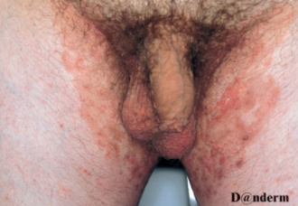

# Tinea inguinalis
## Generelt
Q. Hvad menes i sundhedsvæsenet med *[[Tinea inguinalis]]*? 
A. *Svampeinfektion i lysken*

Q. Hvad hedder *Svampeinfektion i lysken* i sundhedsvæsenet? 
A. *[[Tinea inguinalis]]* 

Q. Beskriv eksantemet – Diagnose(r)?

A. Bilat erytem i inguien med papillære elementer, antydning af maceration i randzonen - [[Tinea inguinalis]]

## Differentialdiagnose

## Udredning
### Anamnese

### Objektiv us.

### Paraklinik

## Behandling

## Opfølgning

## Prognose

<!-- #anki/deck/Medicine #anki/tag/med/Derma -->
## Backlinks
* [[Dermatofytose (tinea)]]
	* [[Tinea inguinalis]]
* [[Tinea inguinalis]]
	* Q. Hvad menes i sundhedsvæsenet med *[[Tinea inguinalis]]*? 
	* Q. Hvad hedder *Svampeinfektion i lysken* i sundhedsvæsenet? 
	* Q. Beskriv eksantemet – Diagnose(r)?
A. Bilat erytem i inguien med papillære elementer, antydning af maceration i randzonen - [[Tinea inguinalis]]
	* [[Tinea inguinalis]]
	* Q. Hvad menes i sundhedsvæsenet med *[[Tinea inguinalis]]*? 
	* Q. Beskriv eksantemet – Diagnose(r)?
	* [[Tinea inguinalis]]

## Backlinks
* [[Tinea inguinalis]]
	* Q. Hvad menes i sundhedsvæsenet med *[[Tinea inguinalis]]*? 
	* Q. Hvad hedder *Svampeinfektion i lysken* i sundhedsvæsenet? 
	* Q. Beskriv eksantemet – Diagnose(r)?
A. Bilat erytem i inguien med papillære elementer, antydning af maceration i randzonen - [[Tinea inguinalis]]
* [[Dermatofytose (tinea)]]
	* [[Tinea inguinalis]]

<!-- {BearID:9131B3F7-5522-4CBA-90BB-A875A99F534C-62499-00007EADB13EFADB} -->
