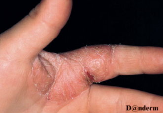

# Tinea manum
## Generelt
Q. Hvad menes i sundhedsvæsenet med *[[Tinea manum]]*? 
A. *Svampeinfektion på hånden*

Q. Hvad hedder *Svampeinfektion på hånden* i sundhedsvæsenet? 
A. *[[Tinea manum]]* 

Q. Beskriv eksantemet – Diagnose(r)?

A. Hyperkeratose, udtørring og ulcus med skældannelse i randzone - [[Tinea manum]]

## Differentialdiagnose
[[Granuloma annulare]]

## Udredning
### Anamnese

### Objektiv us.

### Paraklinik

## Behandling

## Opfølgning

## Prognose

Håndsvamp

<!-- #anki/deck/Medicine #anki/tag/med/Derma -->

## Backlinks
* [[Dermatofytose (tinea)]]
	* [[Tinea manum]]
* [[Tinea manum]]
	* Q. Hvad menes i sundhedsvæsenet med *[[Tinea manum]]*? 
	* Q. Hvad hedder *Svampeinfektion på hånden* i sundhedsvæsenet? 
	* Q. Beskriv eksantemet – Diagnose(r)?
A. Hyperkeratose, udtørring og ulcus med skældannelse i randzone - [[Tinea manum]]
	* [[Tinea manum]]
	* Q. Hvad menes i sundhedsvæsenet med *[[Tinea manum]]*? 
	* Q. Beskriv eksantemet – Diagnose(r)?
	* [[Tinea manum]]

## Backlinks
* [[Tinea manum]]
	* Q. Hvad menes i sundhedsvæsenet med *[[Tinea manum]]*? 
	* Q. Hvad hedder *Svampeinfektion på hånden* i sundhedsvæsenet? 
	* Q. Beskriv eksantemet – Diagnose(r)?
A. Hyperkeratose, udtørring og ulcus med skældannelse i randzone - [[Tinea manum]]
* [[Dermatofytose (tinea)]]
	* [[Tinea manum]]

<!-- {BearID:0ED8019C-1B89-430D-A92F-BA9D38734E5F-62499-00007EB2700858BD} -->
