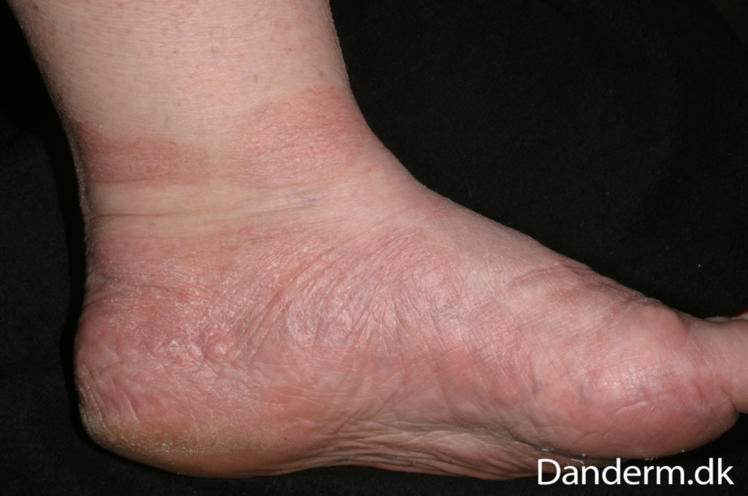

# Tinea pedis
## Generelt
Q. Hvad menes i sundhedsvæsenet med *[[Tinea pedis]]*? 
A. *Svampeinfektion på fod*

Q. Hvad hedder *Svampeinfektion på fod* i sundhedsvæsenet? 
A. *[[Tinea pedis]]* 

Q. Beskriv eksantemet – Diagnose(r)?

A. Let erytem, kridtstregstegning. - Hvis kløe, [[Tinea pedis]] (Moccasinsvamp)

## Differentialdiagnose

## Udredning
### Anamnese

### Objektiv us.

### Paraklinik

## Behandling

## Opfølgning

## Prognose

<!-- #anki/deck/Medicine #anki/tag/med/Derma -->
## Backlinks
* [[Dermatofytose (tinea)]]
	* [[Tinea pedis]]
* [[Tinea pedis]]
	* Q. Hvad menes i sundhedsvæsenet med *[[Tinea pedis]]*? 
	* Q. Hvad hedder *Svampeinfektion på fod* i sundhedsvæsenet? 
	* Q. Beskriv eksantemet – Diagnose(r)?
A. Let erytem, kridtstregstegning. - Hvis kløe, [[Tinea pedis]] (Moccasinsvamp)
	* [[Tinea pedis]]
	* Q. Hvad menes i sundhedsvæsenet med *[[Tinea pedis]]*? 
	* Q. Beskriv eksantemet – Diagnose(r)?
	* [[Tinea pedis]]

## Backlinks
* [[Tinea pedis]]
	* Q. Hvad menes i sundhedsvæsenet med *[[Tinea pedis]]*? 
	* Q. Hvad hedder *Svampeinfektion på fod* i sundhedsvæsenet? 
	* Q. Beskriv eksantemet – Diagnose(r)?
A. Let erytem, kridtstregstegning. - Hvis kløe, [[Tinea pedis]] (Moccasinsvamp)
* [[Dermatofytose (tinea)]]
	* [[Tinea pedis]]

<!-- {BearID:C2FDD8B4-257B-43B1-8C62-9FDC77161E30-62499-00007EB0129D1DF7} -->
