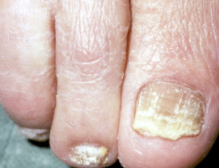

# Tinea unguium
## Generelt
Q. Hvad menes i sundhedsvæsenet med *[[Tinea unguium]]*? 
A. *Svampeinfektion på negl*

Q. Hvad hedder *Svampeinfektion på negl* i sundhedsvæsenet? 
A. *[[Tinea unguium]]* 

Q. Beskriv – Diagnose(r)?

A. Dystrofisk tånegl - [[Tinea unguium]]

## Differentialdiagnose

## Udredning
### Anamnese

### Objektiv us.

### Paraklinik
Q. Du mistænker din pt. for neglesvamp. Hvor skal prøver OBS [[Dermatofytose (tinea)]] tages fra?
A. Overgangen mellem abnorm og normal negl

## Behandling

## Opfølgning

## Prognose

<!-- #anki/tag/med/Infectious #anki/deck/Medicine #anki/tag/med/GP -->
## Backlinks
* [[Dermatofytose (tinea)]]
	* [[Tinea unguium]]
* [[Tinea unguium]]
	* Q. Hvad menes i sundhedsvæsenet med *[[Tinea unguium]]*? 
	* Q. Hvad hedder *Svampeinfektion på negl* i sundhedsvæsenet? 
	* Q. Beskriv – Diagnose(r)?
A. Dystrofisk tånegl - [[Tinea unguium]]

<!-- {BearID:09DB4A64-44B6-4D5A-B5F6-49B1969F9F15-731-000007F61552A449} -->
