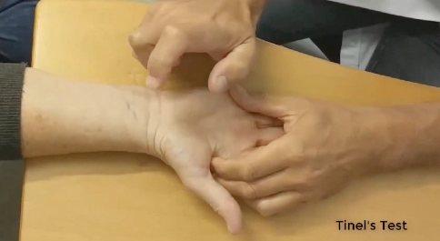

# Tinnels test
Q. Beskriv *Tinnels* test i håndled.
A. Perkussion over karpaltunnelen

Q. Hvad tester *Tinnels* test for i håndled?
A. Karpaltunnelsyndrom

Q. Hvad er et abnormt resultat af *Tinnels* test i håndled?
A. Paræstesi i radiale fingre

## Backlinks
* [[Karpaltunnelsyndrom]]
	* Q. Hvilke kliniske tests findes for karpaltunnelsyndrom?
	* Q. Din patient viser symptomer på [[Karpaltunnelsyndrom]]. Hvad vil du tilføje *den objektive us.*? 
* [[Cubitaltunnelsyndrom]]
	* Q. Din patient viser symptomer på [[Cubitaltunnelsyndrom]]. Hvad vil du tilføje *den objektive us.*? 
* [[N. ulnaris impingement]]
	* Q. Hvor vil du udføre [[Tinnels test]] hvis du mistænker [[N. ulnaris impingement]]?

<!-- #anki/tag/med/Orto #anki/deck/Medicine -->

<!-- {BearID:E103D7B3-60C6-45E3-8857-AC3F9B1A3C24-15088-0000D9717BB28EF0} -->
