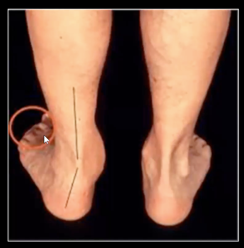

# Too many toes sign
Q. Beskriv *[[Too many toes sign]]*.
A. 

Q. Hvad tester *[[Too many toes sign]]* for?
A. *[[m. tibialis posterior dysfunktion]]*

Q. Hvilken test kan bruges til at teste for *[[m. tibialis posterior dysfunktion]]*?
A. *[[Too many toes sign]]*

Q. Hvad er et abnormt resultat af en *[[Too many toes sign]]*?
A. At kunne se mere end 3 tæer når pt. ses bagfra

## Backlinks
* [[§Ankel]]
	* [[Undersøgelse af fod]]
[[Peeking heel sign]]
* [[Too many toes sign]]
	* Q. Beskriv *[[Too many toes sign]]*.
	* Q. Hvad tester *[[Too many toes sign]]* for?
	* Q. Hvilken test kan bruges til at teste for *[[m. tibialis posterior dysfunktion]]*?
	* Q. Hvad er et abnormt resultat af en *[[Too many toes sign]]*?
* [[Undersøgelse af fod]]
	* [[Too many toes sign]]
* [[Us. af fod og ankel]]
	* *Inspektion:*

<!-- #anki/tag/med/Orto #anki/deck/Medicine #anki/tag/med/GP -->

<!-- {BearID:20C24A28-B7F4-4B73-ABCF-0B8532C20D6A-18513-00001A609FAE0285} -->
