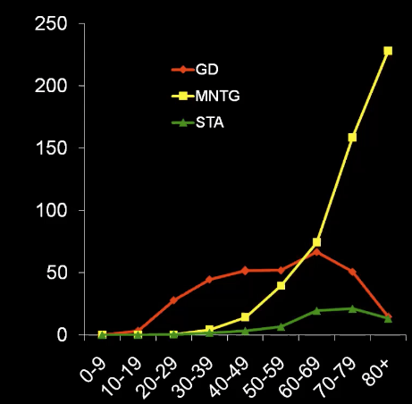

# Toxisk multinodøs struma
## Generelt

## Differentialdiagnose

## Udredning
### Anamnese

### Objektiv us.

### Paraklinik
Q. Din patient får diagnosticeres [[Toxisk multinodøs struma]]. Hvad vil du tilføje til paraklinik?
A. [[DEXA]], OBS [[Osteoporose]].

## Behandling

## Opfølgning

## Prognose

## Backlinks
* [[Thyrotoxikose]]
	* Q. Hvad er de primære årsager til [[Thyrotoxikose]]?
	* Q. I hvilken alder ses især [[Toxisk multinodøs struma]]?

	* Q. Din patient har [[Thyrotoxikose]], men negative [[TRAb]]. Hvad nu?
* [[Toxisk multinodøs struma]]
	* Q. Din patient får diagnosticeres [[Toxisk multinodøs struma]]. Hvad vil du tilføje til paraklinik?
* [[Subklinisk hyperthyreose]]
	* Q. Hvornår skal [[Subklinisk hyperthyreose]] udredes?
* [[Thyroideaskintigrafi]]
	* Q. Hvad ses her?
A. Stor, multinodøs optagelse, OBS [[Toxisk multinodøs struma]]
* [[Struma]]
	* [[Toxisk multinodøs struma]]
* [[Multinodøs struma]]
	* Hvis toxisk, [[Toxisk multinodøs struma]].

<!-- #anki/tag/med/Endocrinology #anki/deck/Medicine -->

<!-- {BearID:4E463917-BA4B-4DD2-8CA0-762941EAE3F9-31003-00006912664AEAA2} -->
