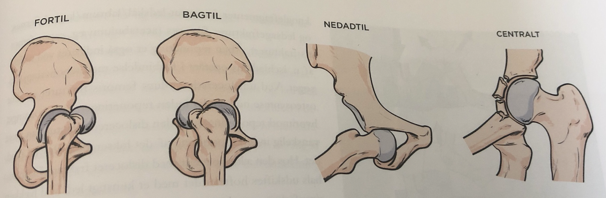

# Traumatisk hofteluksation
Luxatio coxae.

## Generelt
Q. Hvor mange traumatiske hofteluksationer ses i DK pr. år?
A. 50-70

Q. Hvordan opdeles hofteluksation anatomisk?
A. Anterior, posterior, inferior og centralt.

## Differentialdiagnose

## Udredning
### Anamnese

### Objektiv us.

### Paraklinik

## Behandling
Q. Hvor hurtigt skal en subluxeret hofte reponeres?
A. Indenfor timer, OBS avaskulær nekrose

Q. En patient har haft hofteluksation. Hvad er behandlingen?
A. Hvis ikke kontraindicerende traumer: Reponering. Hvis ikke muligt, åben reponering.  

Q. En patient har hofteluksation og caput femoris fraktur. Hvad nu? 
A. Akut osteosyntese af caput femoris fraktur (denne er kontraindikation for reponering), dernæst reponering. 

Q. Hvordan rehabiliteres efter hofteluksation?
A. Hvis uden fraktur: 6-12 uger med bevægeaflastning og passiv bevægelse (fysioterapeut)

## Opfølgning

## Prognose
Q. Hvilke komplikationer ses til traumatisk hofteluksation?
A. T: Neurologiske skader, re-dislocering, I: Heterotrop ossifikation, artrose

<!-- #anki/tag/med/Orto #anki/deck/Medicine -->

<!-- {BearID:30AF82AF-7903-447D-9CE6-D4C94B59B3C8-98900-0000BFAAFAA2738C} -->
