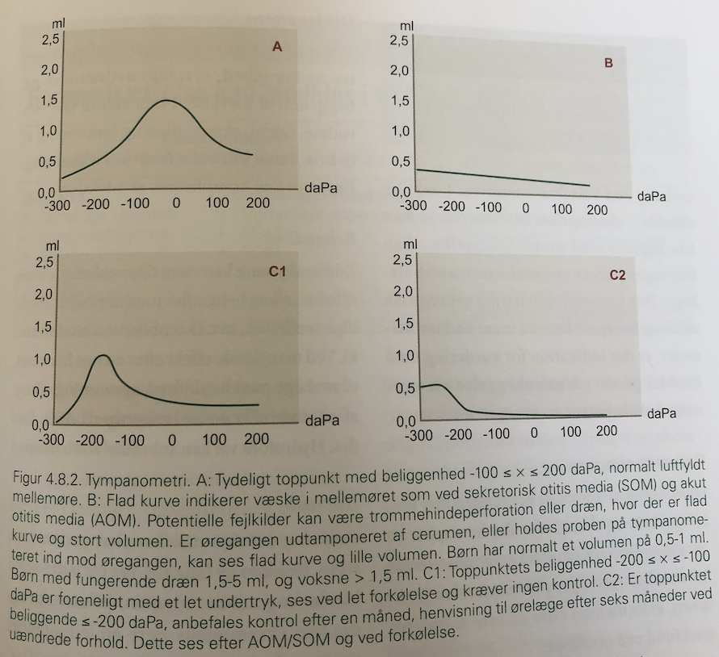

# Tympanometri

## Backlinks
* [[Akut otitis media]]
	* Q. Din patient viser symptomer på [[Akut otitis media]]. Hvad vil du tilføje til *paraklinikken*? 
	* Q. Du har sat et barn i behandling for [[Akut otitis media]]. Hvad nu?
* [[Otalgi]]
	* Q. Din patient viser symptomer på [[Otalgi]]. Hvad vil du tilføje til *paraklinikken*? 

<!-- #anki/deck/Medicine #anki/tag/med/Otolarynghology -->

<!-- {BearID:A80603E1-883B-497B-A2D5-3D8FCB69666F-6575-000004585A64F077} -->
