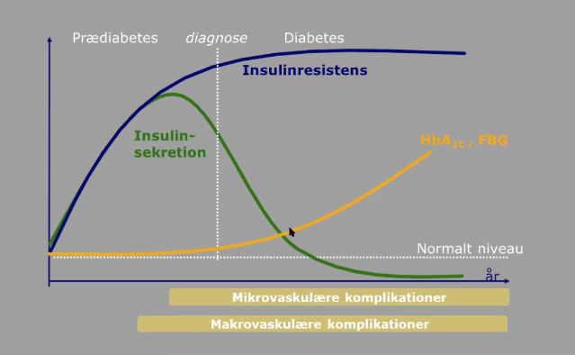

# Type 2 diabetes
## Generelt

Q. Hvad er patofysiologien ved T2D?
A. 1) Nedsat glukoseoptag i muskler, 2) For stor glukoneogenese fra leveren og 3) Sekretion af adipokiner fra fedtceller, der destruerer β-celler i pankreas

Q. En patient har type 2 diabetes. Hvad skyldes det? 
A. Genetisk disposition + fysisk inaktivitet og overvægt

Q. Hvad er risikoen for T2D, hvis en forælder har T2D?
A. Ca. 40%

Q. Din patient er en 28-årig kvinde, overvægtig. Hun vil gerne være gravid. Hvad nu?
A. Udred for T2D, OBS komplikationer for kvinde og barn

## Differentialdiagnose
Q. Hvornår bør der overvejes diagnostik for [[MODY]]?
A. Ved tidlig debut og/eller familiær ophobning af T2D 

## Udredning
### Anamnese
Q. Du mistænker en patient for type 2 diabetes. Hvad er de typiske symptomer? 
A. Typisk ingen, evt. som T1D

### Objektiv us.
Q. Hvad er triaden af parakliniske fund for type 2 diabetes?
A. [[Hypertension]],  [[Hyperglykæmi]], [[Dyslipidæmi]]

### Paraklinik
Q. Du mistænker en patient for type 2 diabetes. Hvordan diagnosticeres det? 
A. Enten 1) P-Glc > 11 eller OGTT > 11 , 2) To fastende P-Glc > 7, 3) To HbA1c > 47

Årlig kontrol hvis:
1. Længerevarende farmaka (2. gen. antipsych, Prednisolon)
2. Aktuel CVD
3. HbA1c mellem 42 og 47
4. Tidl. GDM

## Behandling
[[Behandling af T2D]]
	[[Behandlingsmål ved T2D]]

## Opfølgning
Q. Hvor hyppigt bør screenes for T2D i risikopatienter?
A. Ca. hver 3. år

Q. Hvilke patienter anbefales screenet for T2D?
A. Alder over 45 år og enten: 1) Genetisk disposition for T2D, 2) Overvægt, 3) Dyslipidæmi, 4) Tidligere gestationel diabetes eller 5) CVD

Q. Hvilke organer skal som minimum undersøges ved en T2D årsscreening?
A. Øjne, nyre og fødder (perifære pulse)

Q. Hvor hyppigt skal en T2D-pt. til kontroller?
A. Hver 4 mdr. + årsscreening

## Backlinks
* [[Psoriasis]]
	* Q. Hvilke komorbiditeter vil du især spørge til ved [[Psoriasis]]?
* [[§Diabetes]]
	* [[Type 1 diabetes]] 
[[Type 2 diabetes]]
* [[Træthed]]
	* *E*
[[Hyperparathyroidisme]]
[[Type 2 diabetes]]
[[D-vitaminmangel]]
* [[C-peptid]]
	* Q. Du har målt [[C-peptid]]. Hvad skal gælde for målingen, for at man kan bruge den til at adskille [[Type 1 diabetes]] og [[Type 2 diabetes]]?
* [[PCOS]]
	* Q. Hvilke komplikationer har kvinder med [[PCOS]] øget risiko for?
* [[Komplikationer ved diabetes (T1D/MODY/T2D)]]
	* [[Type 1 diabetes]], [[Type 2 diabetes]], [[MODY]], [[§Diabetes]]

<!-- #anki/tag/med/Endocrinology #anki/deck/Medicine -->

<!-- {BearID:42FFA840-1E4D-4B91-97E9-065D53A69E1D-15088-0000CB1E505AC0D9} -->
