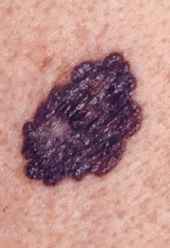
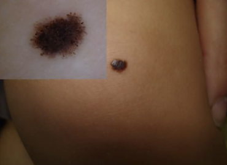
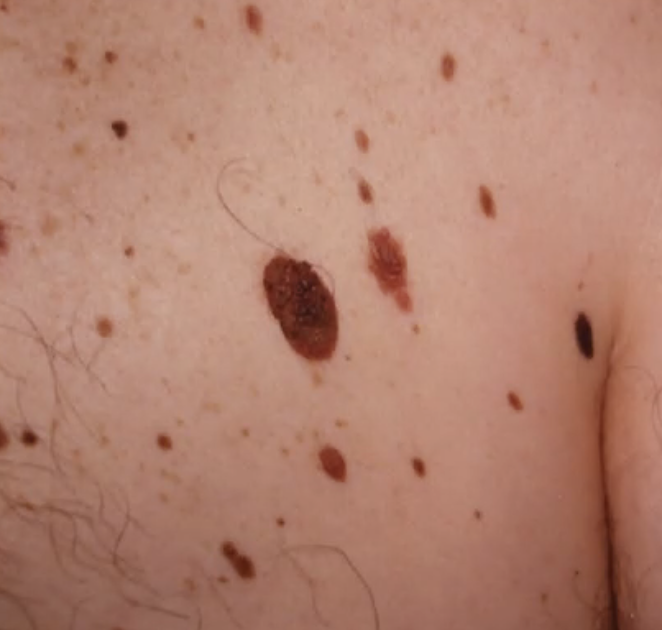
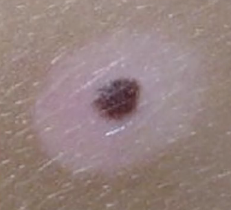
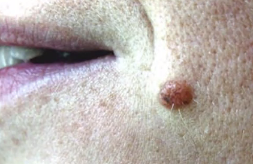
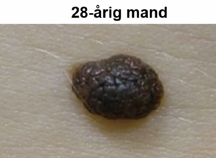

# Udredning af nævus
## Generelt

## Differentialdiagnose

Uregelmæssig, dum farve (grålig centralt, “mælkeslør”).
[[Malignt melanom]]

[[Spitz’ nævus]], hos børn

[[Atypisk nævus syndrom]], ser ufarligt ud.

[[Halo nævus]]

Symmetrisk, velafgrænset, eleveret. Lidt behåring, lidt mørkfarvning.
[[Dermalt nævus]] – pga. udbuling. Fredeligt.

Som udgangspunkt fredelig.
[[Dermalt nævus]]

<!-- #anki/tag/med/Derma #anki/deck/Medicine -->

<!-- {BearID:7B6F13F2-6FBB-49CA-9C61-ABAEFBA718CD-21052-00004AB923D174AF} -->
