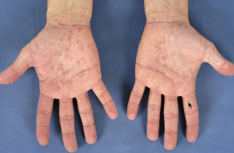

# Udslet i håndflader
## Generelt

## Differentialdiagnose

## Udredning
### Anamnese

### Objektiv us.
Q. Din patient kommer med dette udslet *og almensymptomer*. Hvilke diagnoser tænker du?
 
A. 1) [[Syfilis]], 2) Parvo B19, 3) [[HIV]]

Q. Din patient kommer med dette udslet *og kløe*. Hvilke diagnoser tænker du?
 
A. 1) [[Scabies]], [[Medikamentelt eksantem]]

Q. Din patient kommer med dette udslet *uden andre symptomer*. Hvilke diagnoser tænker du?

A. [[Medikamentelt eksantem]]

### Paraklinik

## Behandling

## Opfølgning

## Prognose

<!-- #anki/tag/med/Derma #anki/deck/Medicine -->

<!-- {BearID:27DF0F76-1DA6-4EAA-A953-3A3E1AA124C8-15159-0000304FC37F8EF0} -->
