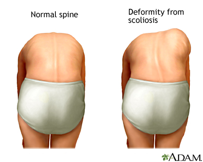
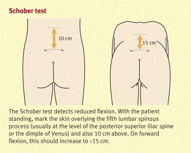

# Undersøgelse af ryg
[[§Ryggen]]

Husk evt. [[Undersøgelse af hofte]].

[Undersøgelsesvideoer til studerende - Ortopædkirurgi - Aarhus Universitetshospital](https://www.auh.dk/afdelinger/ortopadkirurgi/til-fagfolk/undersogelsesvideoer)

## Stående
 Skuldersymmetri
	2. Hoftekammes symmetri
	3. Kyfose
	4. Lordose
	5. Foroverbøjning
		1. Asymmetrisk ved skoliose eller diskusprolaps
		2. [[Adams test]]
	6. [[Trendelenburgs test]]
	7. Sidebøjning
		1. Mål afstand fra fingerspidser stående til fingerspidser når sidebøjet
	8. Palpation
		1. Processi spinosi (alignment, OBS [[Spondylolistese]])

## Liggende
[[Undersøgelse af hofte]]

## Gang
På tæer
På hæle

Q. Hvilke faktorer bør inspiceres ved ryg?
A. Holdes ansigtet lige, kyfose eller lordose, skoliose/bækkenet i balance, Adams test

Q. Beskriv *Adams test* i ryggen.
A. 

Q. Hvad tester *Adams test* for i ryggen?
A. Scoliose

Q. Hvad er et abnormt resultat af *Adams test* i ryggen?
A. Asymmetrisk ryg ved fleksion:

Q. Hvordan palperes ryg?
A. Smerter ved kompression, muskulatur ved hals, palpation af processi spinosi og paravertebralt.

Q. Hvor mange grader kan raske halskolumnaer *flektere*? 
A. Til hagen på bryst

Q. Hvor mange grader kan raske halskolumnaer *ekstendere*? 
A. Til kig mod loft

Q. Hvor mange grader kan raske halskolumnaer *lateralflektere*? 
A. 45 grader

Q. Beskriv *Schobers test* i lænden.
A. Mål 10 cm. kranio-sakralt, flekter ryg, mål igen

Q. Hvad tester *Schobers test* for i lænden?
A. Lændemobilitet

Q. Hvad er et abnormt resultat af *Schobers test* i lænden?
A. 10 cm bliver forlænget til under 15 cm ved fleksion 

Q. Hvordan undersøges lateralflektion af ryggen?
A. Arm langs ben, før så langt som muligt.

Q. Beskriv *Lasegues* i ryggen.
A. Patienten ligger fladt på ryg, ben fuldt ekstenderet. Benet bevæges i hoften.

Q. Hvad tester *Lasegues* for i ryggen?
A. Nerverodsirritation

Q. Hvad er et abnormt resultat af *Lasegues* i ryggen?
A. Smerter ved under 60 graders fleksion

## Backlinks
* [[Scoliose]]
	* Der er mere i [[Undersøgelse af ryg]], især videoen.
* [[Undersøgelsesteknik]]
	* [[Undersøgelse af ryg]]

<!-- #anki/tag/med/Orto #anki/deck/Medicine -->

<!-- {BearID:E69AB7D2-2D0C-4F85-AA77-7F875B4D9FC7-85278-00006497711B7B65} -->
