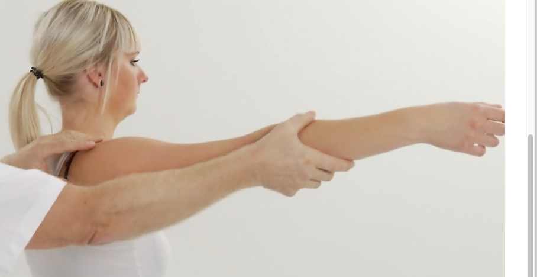

# Undersøgelse af skulder
[Undersøgelsesvideoer til studerende - Ortopædkirurgi - Aarhus Universitetshospital](https://www.auh.dk/afdelinger/ortopadkirurgi/til-fagfolk/undersogelsesvideoer)

1. Stående
	1. Inspektion
		1. Symmetri af skulder
	2. Funktion
		1. Aktiv/passiv bevægelighed
			1. Langsomt løft af arme over hovedet
			2. Abduktion
			3. Udadrotation med albuerne i siden
			4. Indadrotation: Hvor langt kan armene nå op ad ryggen
		2. Test
			1. [[Anterior skulderinstabilitet]]
				1. [[Afværgetest i skulderen]]
			2. [[Posterior skulderinstabilitet]]
				1. “Klik” når skulderen går på plads

		3. Samlet instabilitet
			1. [[Skuffetest i skulder]]
		4. [[Superior skulderinstabilitet]]
			1. [[Sulcustesten]]
		5. [[Subacromialt impingement syndrom]]
			1. [[Painful arc]]
			2. [[Hawkins test]]
			3. [[Neers test]]
			4. [[Empty can test]]
			5. Udadrotationstest
		6. AC-led
			1. [[Crossover test]]
1. Liggende
	1. Palpation
		1. AC-led
		2. Biceps
		3. Bursa
	2. Funktion

https://ortopaedi.dk/fileadmin/DSSAK/kurser/Skulder_kompendium.pdf

Q. Hvordan tester man hurtigst, at patientens skulder er rask?
A. Armen kan nå: 1) Strakt over hovedet, 2) Modsatte skulder, 3) Nakken og 4) Lænden

Q. Du skal undersøge en skulders mobilitet. Hvilke håndgreb er nødvendige under undersøgelsen?
A. Fiksering af scapula

Q. Hvor mange grader kan en normal skulder *flektere*?
A. 180

Q. Hvor mange grader kan en normal skulder *ekstendere*?
A. 40

Q. Hvor mange grader kan en normal skulder *abducere*?
A. 180

Q. Hvor mange grader kan en normal skulder *udadrotere*?
A. 60

Q. Hvor mange grader kan en normal skulder *indadrotere*?
A. Til den når mellem scapulae

## Backlinks
* [[§Skulderen]]
	* [[Undersøgelse af skulder]]

<!-- #anki/tag/med/Orto #anki/deck/Medicine -->

<!-- {BearID:92752A4E-B430-4AD8-9F1A-5D2060237F92-4231-000017C585C0299D} -->
