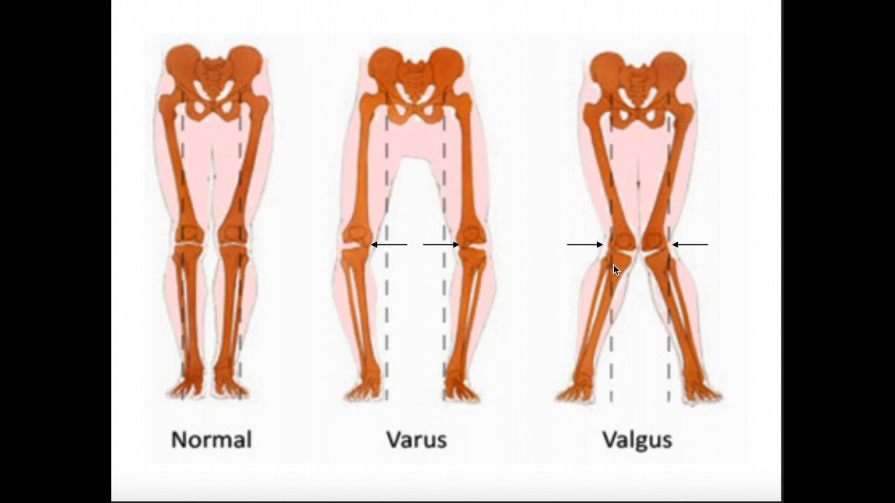

# Undersøgelsesteknik
Q. Hvilke faktorer vil du inspicere for i et planlagt operationsfelt?
A. Store sår (kan hæmme sårheling)

Led:
* [[§Skulderen]]
	* [[§Albue]]
	* [[§Underarm]]
	* [[§Håndled]]
	* [[§Hånden]]
		* [[§Tommelen]]
		* [[Fingre]]
* [[Undersøgelse af ryg]]
* [[§Hofte]]

## Funktion
Q. Beskriv graderingen af muskelstyrke.
A. 0) Ingen følelig kontraktion, 1) Kontraktion uden bevægelse, 2) Bevægelse uden tyngdekraft, 3) Lille bevægelse mod tyngekraft, 4) Mod lille modstand), 5) Normal muskelstyrke

Q. Beskriv grad 4 muskelstyrke
A. Bevægelse mod lille modstand

Q. Beskriv grad 2 muskelstyrke
A. Bevægelse uden tyngdekraft

Q. Beskriv grad 1 muskelstyrke
A. Kontraktion, ingen bevægelse

Q. Beskriv grad 5 muskelstyrke
A. Normal muskelstyrke

Q. Beskriv grad 0 muskelstyrke
A. Ingen kontraktion

Q. Beskriv graderingen af ledløshed
A. 0) Ingen løshed, I) Under 5 graders løshed, II) Mere end 5 graders løshed, III) Løshed uden slutpunkt

Q. Beskriv grad 0 ledløshed
A. Ingen løshed

Q. Beskriv *grad II* ledløshed
A. Mere end 5 graders løshed

Q. Beskriv *grad I* ledløshed
A. Mindre end 5 graders løshed

Q. Eksemplificer beskrivelse af ledløshed ved et knæ
A. 10 graders valgusløhed ved 30 graders fleksion

Q. Beskriv valgus
A. Foden bevæger sig lateralt for knæet (val*G*us, *G*o away)

Q. Beskriv varus
A. Foden bevæger sig medialt for knæet (va*R*us, *R*eturn)

<!-- #anki/tag/med/Orto #anki/deck/Medicine -->

<!-- {BearID:FA2417BE-FED9-434C-AE13-A4F940111A1E-85278-00005CEE02A8670F} -->
