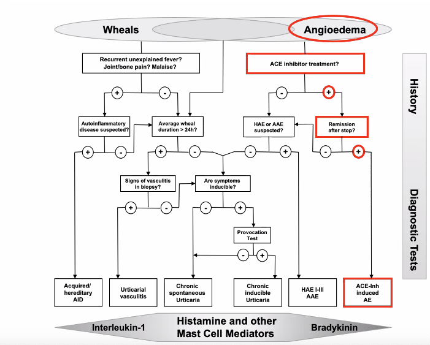

# Urticaria

## Generelt
Q. Hvad er den hyppigste årsag til [[Urticaria]]?
A. Spontant, dvs. uden kendt årsag

Q. Hvor stor en del af [[Urticaria]] er allergisk (IgE)-medieret?
A. Ca. 3%

## Differentialdiagnose
[[Akut urticaria]]
	[[Infektions-induceret urticaria]]
	[[Dermografisme]]
	[[Tryk-urticaria]]
	[[Kolinerg urticaria]]
	[[Solar urticaria]]
	[[Kulde-urticaria]]
	[[Kontakt-urticaria]]
	[[Aquagen urticaria]]
	[[Strophulus]]

[[Kronisk urticaria]]
	[[Dermografisme]]

[[Urticariel vasculitis]]

[[Angioødem]]
[[ACE-hæmmer-angioødem]]

[[Mastocytose]]

Q. Hvordan adskilles [[Urticaria]] fra [[Angioødem]] anatomisk?
A. [[Urticaria]] er huden, [[Angioødem]] er subcutis og slimhinder

Q. Hvordan kan man i den objektive us. adskille [[Urticaria]] fra [[Angioødem]]?
A. [[Angioødem]] ses især omkring øjne og læber (her kan hævelsen i underhuden strække huden).

## Udredning
### Anamnese
Q. Hvilke hyppige årsager til [[Urticaria]] bør spørges til i AP?
A. T) Insektstik, I) [[ASA]]/[[NSAID]], B) Fødevarer

Q. Beskriv *S* OCRATES for Urticaria 
A. Universelt eller lokalt

Q. Beskriv S *O* CRATES for Urticaria 
A. Efter eksponering

Q. Beskriv SO *C* RATES for Urticaria 
A. Kløende kvadler uden [[Ekskoriasion]]

Q. Beskriv SOCRA *T* ES for Urticaria 
A. Flytter sig indenfor 24 timer, forsvinder hurtigt på [[Antihistamin]]

Q. Hvilke alarmsymptomer bør lede til udredning for [[Urticariel vasculitis]]?
A. Hvis kvadlerne enten 1) Er samme sted mere end 24 timer 2) Hæmorragerer

Q. Hvis [[Urticaria]] står mere end 24 timer, hvad skal man så mistænke?
A. [[Urticariel vasculitis]]

Q. Hvordan adskilles [[Urticaria]] fra [[Erythema multiforme]]?
A. [[Urticaria]] har voldsom kløe 

### Objektiv us.
[[Kvadel]]. Fravær er [[Ekskoriasion]] er karakteristisk.

### Paraklinik

## Behandling
Q. En patient har [[Kronisk urticaria]] i AP. Hvad nu?
A. 1) Infektionstal, evt. [[TSH]]. 2) Seponer evt. udløsende lægemidler. 3) Hvis normale og ingen effekt, henvisning til dermatolog.

Q. Hvordan behandles [[Urticaria]]?
A. 1) Ikke-sløvende [[Antihistamin]], op til 4x anbefalet dagsdosis. I *meget* svære tilfælde kan overvejes 2) Hvis kronisk, [[Omalizumab]]

## Opfølgning

## Prognose

<!-- #anki/tag/med/Derma #anki/deck/Medicine #anki/tag/med/GP -->

## Backlinks
* [[Urticaria]]
	* Q. Hvad er den hyppigste årsag til [[Urticaria]]?
	* Q. Hvor stor en del af [[Urticaria]] er allergisk (IgE)-medieret?
	* Q. Hvordan adskilles [[Urticaria]] fra [[Angioødem]] anatomisk?
	* Q. Hvordan adskilles [[Urticaria]] fra [[Angioødem]] anatomisk?
	* Q. Hvordan kan man i den objektive us. adskille [[Urticaria]] fra [[Angioødem]]?
	* Q. Hvilke hyppige årsager til [[Urticaria]] bør spørges til i AP?
	* Q. Hvis [[Urticaria]] står mere end 24 timer, hvad skal man så mistænke?
	* Q. Hvordan adskilles [[Urticaria]] fra [[Erythema multiforme]]?
	* Q. Hvordan adskilles [[Urticaria]] fra [[Erythema multiforme]]?
	* Q. Hvordan behandles [[Urticaria]]?
* [[Angioødem]]
	* Q. En patient har [[Angioødem]] men ingen [[Urticaria]]. Hvad nu?
* [[Kolinerg urticaria]]
	* Q. Hvordan adskilles *[[Kolinerg urticaria]]* fra almindelig [[Urticaria]]? 
	* Q. Hvad hedder *[[Urticaria]] udløst af svedsekretion* i derma? 
	* Q. Hvordan adskiller [[Kolinerg urticaria]] sig morfologisk fra [[Urticaria]]? 
* [[Tryk-urticaria]]
	* Q. Hvad menes i dermatologi med *[[Tryk-urticaria]]*? 
	* Q. Hvad hedder *[[Urticaria]] 3-6 timer efter tryk* i derma? 
* [[Kronisk urticaria]]
	* Q. Hvordan defineres [[Kronisk urticaria]]?
* [[Dermografisme]]
	* Q. Hvad menes i dermatologi med *[[Dermografisme]]*? 
	* Q. Hvad hedder *[[Urticaria]] på få minutter efter traume* i derma? 
* [[Mastocytose]]
	* /QE. Hvordan adskiller de objektive fund ved [[Mastocytose]] sig fra [[Urticaria]]?
	* /QE. Beskriv [[Dariers tegn]].
* [[Reaktive erytematøse sygdomme]]
	* Sygdomme med [[Erytem]]. Eg. [[Urticaria]], [[Erythema multiforme]], [[Erythema nodosum]], [[Exanthema medicamentale]], [[Toksisk epidermal nekrolyse]], [[Erythema migrans]], [[Sweets syndrom]], [[Erythema annulare centrifugum]], [[Erythema gyratum]], [[Leukocytoklasisk vaskulitis]], [[Allergisk vaskulitis]], [[Henoch-Schönleins purpura]], [[Kawasakis sygdom]], [[Erythema ab igne]]

<!-- {BearID:0C1C10DD-0357-4440-9453-EFBC5788893D-21842-000034D8A33447B1} -->
