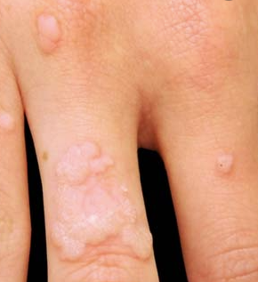
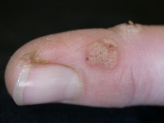
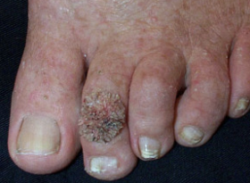
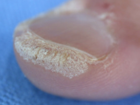
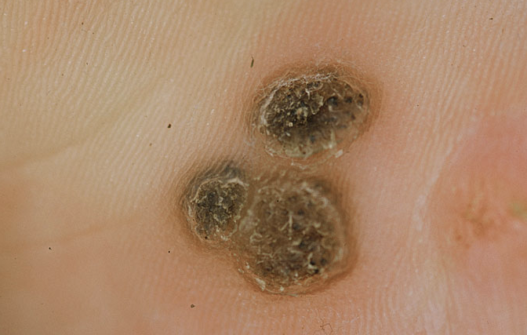

# Verruca vulgaris
## Generelt
Q. Hvad menes i sundhedsvæsenet med *[[Verruca vulgaris]]*? 
A. *Almindelige vorter*

Q. Hvad hedder *almindelige vorter* i sundhedsvæsenet? 
A. *[[Verruca vulgaris]]* 

## Differentialdiagnose
Q. 

Hvad ses her?
A. [[Verruca vulgaris]]

Q. 

Hvad ses her?
A. [[Verruca vulgaris]]

Q. 

Hvad ses her?
A. [[Verruca vulgaris]]

Q. 

Hvad ses her?
A. [[Verruca vulgaris]]

Q. 

Hvad ses her?
A. [[Verruca vulgaris]]

Q. Du ser en lille, plantar hyperkeratose. Hvad mistænker du?
A. [[Verruca vulgaris]] eller [[Clavi (ligtorne)]]

Q. Hvordan adskilles [[Verruca vulgaris]] og [[Clavi (ligtorne)]]?
A. Clavi er 1) Ømme, 2) Bløder ikke ved gennemskæring.

## Udredning
### Anamnese

### Objektiv us.

### Paraklinik

## Behandling
Svinder spontant indenfor år, men kan fjernes med: 
1. Kryoterapi
2. Kemisk ætsning
3. Iquimod 5%
4. Beskæring
5. Keratolytiske midler

## Opfølgning

## Prognose

Vorter, skyldes ofte HPV (1, 2 og 4). 

## Backlinks
* [[Verruca vulgaris]]
	* Q. Hvad menes i sundhedsvæsenet med *[[Verruca vulgaris]]*? 
	* Q. Hvad hedder *almindelige vorter* i sundhedsvæsenet? 
	* Q. 
Hvad ses her?
A. [[Verruca vulgaris]]
	* Q. 
Hvad ses her?
A. [[Verruca vulgaris]]
	* Q. 
Hvad ses her?
A. [[Verruca vulgaris]]
	* Q. 
Hvad ses her?
A. [[Verruca vulgaris]]
	* Q. 
Hvad ses her?
A. [[Verruca vulgaris]]
	* Q. Du ser en lille, plantar hyperkeratose. Hvad mistænker du?
	* Q. Hvordan adskilles [[Verruca vulgaris]] og [[Clavi (ligtorne)]]?
* [[Tumorer i huden]]
	* [[Keratinocyt]]
	[[Keratoakantom]]
	[[Milier]]
	[[Verruca vulgaris]]
	[[Kønsvorter (brug Condyloma acuminata)]]
	[[Molluscum contagiosum]]

<!-- #anki/tag/med/Derma #anki/deck/Medicine #anki/tag/med/GP -->

<!-- {BearID:EFCC0E2E-56E9-4AA6-9170-847CC1F9844C-62499-00007DD2BC9D0CA2} -->
