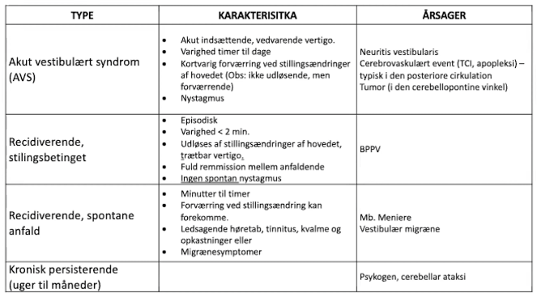

# Vertigo
## Generelt
Bevægeillusion (nautisk/rotatorisk)

## Differentialdiagnose
Centralt eller perifært?

	 

Q. Hvordan adskilles [[Akut vestibulært syndrom (AVS)]] fra [[BPPV]]?
A. [[BPPV]] har kort varighed (< 2 min) og fuld remission mellem anfaldene.

## Udredning
### Anamnese

### Objektiv us.

### Paraklinik

## Behandling

## Opfølgning

## Prognose

## Backlinks
* [[Svimmelhed]]
	* ØNH svimmelhed ([[Vertigo]]), bevægeillusion
	* Q. En patient rapporterer “[[Svimmelhed]]”. Hvilke typer skal adskilles?
	* Q. Hvilke *vaskulære* differentialdiagnoser findes til [[Vertigo]]?
	* Q. Hvilke *infektiøse* differentialdiagnoser findes til [[Vertigo]]?
	* Q. Hvilke *traumatiske* differentialdiagnoser findes til [[Vertigo]]?
	* Q. Hvilke *metaboliske* differentialdiagnoser findes til [[Vertigo]]?
	* Q. Hvilke *iatrogene* differentialdiagnoser findes til [[Vertigo]]?
	* Q. Hvilke *idiopatiske* differentialdiagnoser findes til [[Vertigo]]?
	* Q. Hvilke *neoplastiske* differentialdiagnoser findes til [[Vertigo]]?
	* Q. Hvilke *behavioristiske* differentialdiagnoser findes til [[Vertigo]]?
* [[Rotatorisk vertigo]]
	* [[Vertigo]]

<!-- #anki/deck/Medicine #anki/tag/med/Otolarynghology #anki/tag/med/GP -->

<!-- {BearID:8CF086EA-3A51-40BF-B6B8-087727BF7C28-62757-00006F352E4931FB} -->
