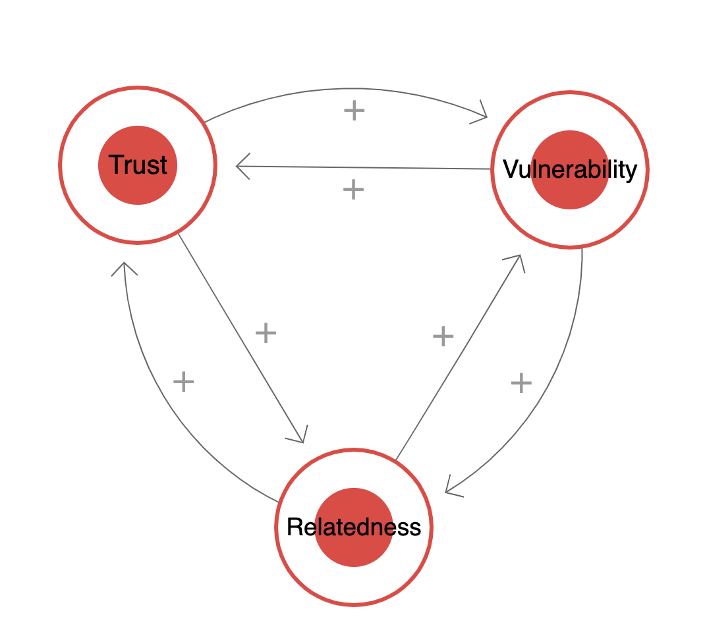

# Vulnerability, Trust and Relatedness are self-reinforcing

Trust allows me to be more vulnerable. Being vulnerable, and getting support without getting hurt, makes me more trusting. Both of these are the reason for experiencing relatedness.

https://ncase.me/loopy/v1.1/?data=[[[3,482,351,0.5,%22Trust%22,0],[4,810,354,0.5,%22Vulnerability%22,0],[5,646,626,0.5,%22Relatedness%22,0]],[[4,5,71,1,0],[5,3,73,1,0],[3,4,60,1,0],[4,3,0,1,0],[3,5,0,1,0],[5,4,-2,1,0]],[],5%5D

## Backlinks
* [[Optimising for the individual eliminates the benefits of community]]
	* Why is that? [[Vulnerability, Trust and Relatedness are self-reinforcing]]. If you optimise for the individual, you’re not committing to a community in fear of regret, and that lack of commitment means you’re less trustworthy over time. That means that [[Commitment builds community]].

<!-- {BearID:3ADE62BA-4EA1-4DDA-A182-21F8F29A6E2E-98900-0000B5E59375F785} -->
