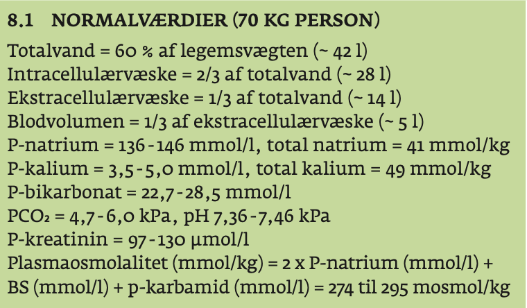
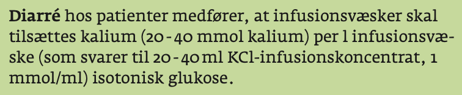

# Væskebehandling
[file:E0AC545E-011A-4EA2-85AA-2EFBC0078053-71192-0001021AFF7DC941/Væske og elektrolytbehandling.pdf]

## Generelt

Q. Hvorfor tilsættes der glukose, når en fastende patient får væske?
A. Undgå ketose (dårligere heling)

Q. Hvorfor tilsættes K+ til væske, hvis diarre?
A. Kaliumtab fra tyktarmen

## Differentialdiagnose

## Udredning
### Anamnese

### Objektiv us.

### Paraklinik
[[Dehydrering]]

## Behandling

## Opfølgning

## Prognose

<!-- #anki/deck/Medicine #anki/tag/med/Acute care# -->

<!-- {BearID:3E703B96-C38A-4EEF-8172-1159114500D4-71192-0001021723A4444E} -->
