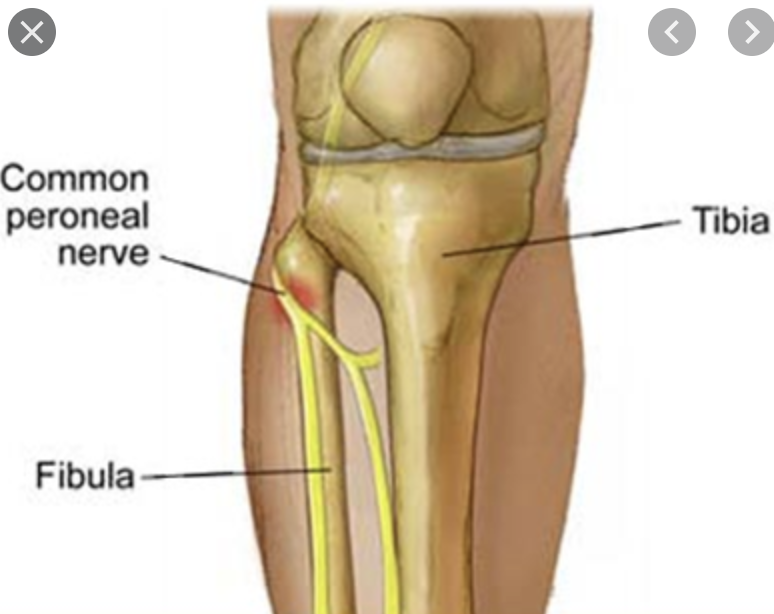

# n. peroneus
## Generelt
Q. Hvor afklemmes [[n. peroneus]] typisk?
A. Omkring caput fibulae

## Differentialdiagnose

## Udredning
### Anamnese

### Objektiv us.

### Paraklinik

## Behandling

## Opfølgning

## Prognose
 

## Backlinks
* [[n. peroneus]]
	* Q. Hvor afklemmes [[n. peroneus]] typisk?

* [[Knæluksation]]
	* Q. Hvilke neurovaskulære komplikationer ses hyppigt ved [[Knæluksation]]?

<!-- #anki/tag/med/Orto #anki/deck/Medicine -->

<!-- {BearID:BAC4BEBB-DE0B-4341-A802-F8431904F900-15618-00001ECF82A2AC7D} -->
