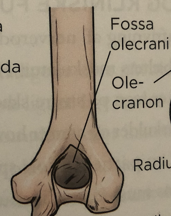
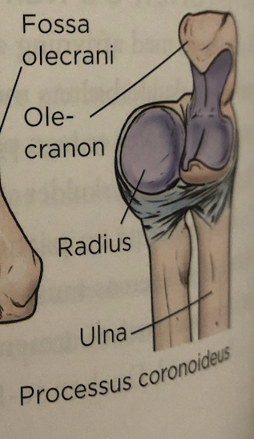
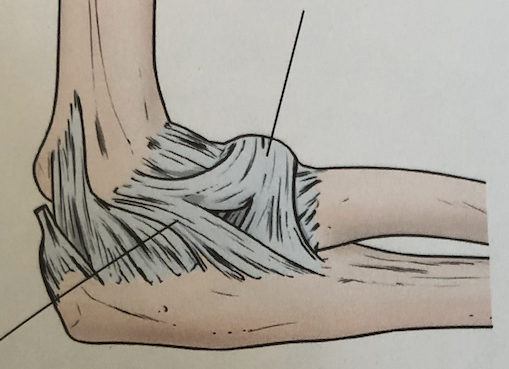
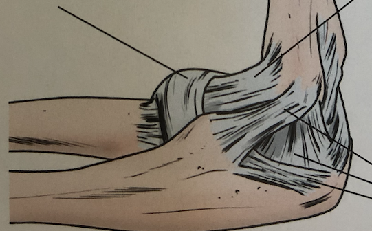

# §Albue
[[Undersøgelse af albue]]

## Diagnoser
1. [[Lateral epicondylitis]]
2. [[Medial epicondylitis]]
3. [[Cubitaltunnelsyndrom]]

*Hos voksne*
1. [[Distal humerusfraktur hos voksne]]
2. [[Caput radii fraktur]]
3. [[Olecranonfraktur]]
4. [[Capitellum humeri fraktur]]

*Hos børn*
1. [[Lateral epicondylfraktur]]
2. [[Medial epicondylfraktur]]
3. [[Collum radii fraktur]]
4. [[Distal suprakondylær humerusfraktur i børn]]

## Anatomi

Q. Hvad hedder strukturen nederst til venstre?

A. Capitellum

Q. Her ses en albue. Hvad hedder strukturen til venstre?

A. Det laterale collaterale ligament

Q. Her ses en albue. Hvad hedder strukturen til højre?

A. Lig. annulare

Q. Her ses en albue. Hvad hedder strukturen øverst?

A. Den anteriore kapsel

Q. Hvilke led findes i en [[Albue]]?
A. 1) Humero-ulnart og 2) Humero-radialt og 3) Radio-ulnart

## Backlinks
* [[Distal suprakondylær humerusfraktur i børn]]
	* Smerter nær [[§Albue]]. 60% af albuefrakturer i børn.
* [[Bursitis olecranii]]
	* En [[Bursit]] i [[§Albue]], [[Olecranon]].
* [[Olecranon]]
	* Den primær knogle i [[§Albue]].
* [[Undersøgelsesteknik]]
	* [[§Albue]]

<!-- #anki/tag/med/Orto #anki/deck/Medicine -->

<!-- {BearID:8AEEBA0D-8438-4574-BCC5-CF0625515C06-85278-00006127BDC987AA} -->
