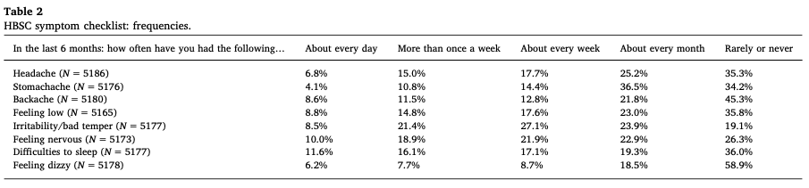

# §Article-idea 3
#### Hvilket problem prøver vi at løse?
Vi har børn i hospitalssektoren med uspecifikke symptomer. Vi har svært ved at kategorisere, hvilke der skal have hjælp i hospitalsvæsnet, og hvilke der ville have gavn af psykologisk eller ingen intervention. At forstå, hvad der forårsager symptomerne, gør det nemmere at hjælpe børnene.

For at prioritere, hvad man skal forstå først, giver det mening at vide: 
1. Hvad ser vi
2. Hvad er hyppigst
3. Hvad er alvorligst

Under “hvad ser vi” skal vi vide, om symptomerne er uafhængige, om de skal ses som mindre grupper, eller om de skal ses som en samlet enhed.  

Når vi ved det kan vi kigge på, hvad der er hyppigst – både de enkelte symptomer, og evt. grupper.

Hvad der er alvorligst (både for patient og samfund) kan delvist besvares fra medicin og lægesøgning. De bliver proxyer for, hvor alvorligt læge+patient føler symptomerne er og om de forventer der kan gøres noget ved dem.

Man ved allerede til dels, hvad der er hyppigst fra WHOs 4-årige HBSC. Men vi ved ikke, om der findes grupperinger i symptomer, og ej heller, hvilke symptomer/symptomgrupper der leder til mest lægesøgning.

Grupperingerne er delvist undersøgt i co-variations studier og et enkelt studie der tester prævalens af symptomer mellem børn med og uden mavesmerter. De viser at symptomerne har tendens til at optræde sammen – men de har ikke testet, om det er fordi de alle skal ses som del af en stor fælles gruppe, eller om der er egentlige undergrupperinger.

#### Hvordan vil vi løse det?
Beskriv symptomerne i en symptom x frekvens tabel, med prævalens i cellerne.

	
Cluster-analyse: Findes der clusters? Hvis ja, hvor stor er kontrasten så i hyppighed af de givne symptomer mellem clusters? Og hvordan ser associationerne ud til udfald?. [[Cluster-analyse til artikel 3]].

Desuden associationen af enkelte symptomer til udfald. 

Foreslåede udfald (nok kun 1 eller 2):
	* Hospitalskontakter; hvilke symptomer er almen praksis bekymrede for/tolker som alarmsymptomer
	* Diagnoser; hvilke symptomer er prædiktive for hvilke diagnoser, og ser vi paradoksale mønstre? [[Is MHC associated with outcomes in ways that are not face valid]]
	* Medicin, som ovenfor

#### Hvordan vil vi fortolke det?
Hvis der findes væsentlig kontrast mellem clusters tyder det på, at der er egentlige symptomkomplekser. Hvis ikke, at symptomerne kan ses hver for sig eller som en eller to dimensioner.

Hvis symptomerne hver for sig er prædikative for forskellige udfald tyder det på, at de i øjeblikket ses hver for sig af patient+sundhedsvæsen. Hvis ikke, at de kan ses som en eller to dimensioner.

## Backlinks
* [[§Towards an understanding of Multiple Health Complaints]]
	* [[§Article-idea 3]]

<!-- {BearID:D3BD4231-E785-4DA5-9CC3-6D7E999616F4-484-0000015573DCD930} -->
